# Database ERD

This Mermaid `erDiagram` covers the six runtime schemas used by the app: `core`, `ai`, `trading`, `market`, `academy`, and `meridian`.

Mermaid ER diagrams do not support rendered subgraphs, so schema grouping is shown with schema-prefixed entity names and section labels. `auth.users` is included as an external reference because several foreign keys terminate there.

```mermaid
erDiagram
  %% External reference: auth
  auth_users {
    uuid id PK
  }

  %% Schema: core
  core_users {
    uuid id PK
    uuid auth_id FK
    text email
    text userType
  }
  core_achievements {
    uuid id PK
    uuid user_id FK
    text name
  }
  core_user_profiles {
    uuid id PK
    uuid user_id FK
    int knowledge_tier
    text risk_profile
  }
  core_rate_limit_state {
    text identifier PK
    text endpoint PK
    text window_type PK
    timestamptz window_start
  }

  %% Schema: ai
  ai_chats {
    uuid id PK
    uuid user_id FK
    text title
  }
  ai_chat_messages {
    uuid id PK
    uuid user_id FK
    uuid chat_id FK
    text role
  }
  ai_iris_context_cache {
    uuid user_id PK
    jsonb profile_summary
    jsonb active_goals
    int knowledge_tier
  }

  %% Schema: trading
  trading_portfolio_history {
    uuid id PK
    uuid user_id FK
    date date
    numeric value
  }
  trading_open_positions {
    uuid id PK
    uuid user_id FK
    text symbol
    numeric entry_price
  }
  trading_trades {
    uuid id PK
    uuid user_id FK
    text symbol
    text action
  }
  trading_trade_journal {
    uuid id PK
    uuid user_id FK
    uuid trade_id FK
    text symbol
    text type
  }
  trading_paper_trades {
    uuid id PK
    uuid user_id FK
    text symbol
    text status
  }
  trading_paper_trade_closes {
    uuid id PK
    uuid user_id FK
    uuid buy_trade_id FK
    numeric close_price
  }

  %% Schema: market
  market_market_indices {
    uuid id PK
    text symbol UK
    text name
  }
  market_trending_stocks {
    uuid id PK
    text symbol
    text name
  }
  market_news_articles {
    uuid id PK
    text link UK
    text source
  }
  market_news {
    uuid id PK
    text link UK
    text provider
  }
  market_stock_snapshots {
    bigint ticker_id PK
    text ticker
    numeric last_price
  }

  %% Schema: academy
  academy_profiles {
    uuid id PK
    text display_name
  }
  academy_tiers {
    uuid id PK
    text slug UK
    int order_index
  }
  academy_lessons {
    uuid id PK
    uuid tier_id FK
    text slug UK
  }
  academy_lesson_sections {
    uuid id PK
    uuid lesson_id FK
    int order_index
  }
  academy_lesson_blocks {
    uuid id PK
    uuid lesson_id FK
    uuid section_id FK
    int order_index
  }
  academy_prompt_templates {
    uuid id PK
    text key UK
  }
  academy_lesson_prompt_links {
    uuid id PK
    uuid lesson_id FK
    uuid prompt_template_id FK
  }
  academy_quizzes {
    uuid id PK
    uuid lesson_id FK
  }
  academy_quiz_questions {
    uuid id PK
    uuid quiz_id FK
    int order_index
  }
  academy_quiz_options {
    uuid id PK
    uuid question_id FK
    int order_index
  }
  academy_quiz_attempts {
    uuid id PK
    uuid quiz_id FK
    uuid user_id FK
  }
  academy_quiz_answers {
    uuid id PK
    uuid attempt_id FK
    uuid question_id FK
  }
  academy_user_lesson_progress {
    uuid id PK
    uuid user_id FK
    uuid lesson_id FK
    uuid last_quiz_attempt_id FK
  }
  academy_user_tier_enrollments {
    uuid id PK
    uuid user_id FK
    uuid tier_id FK
  }
  academy_chat_sessions {
    uuid id PK
    uuid user_id FK
    uuid lesson_id FK
  }
  academy_chat_messages {
    uuid id PK
    uuid session_id FK
    text role
  }

  %% Schema: meridian
  meridian_user_goals {
    uuid id PK
    uuid user_id FK
    text goal_name
  }
  meridian_risk_alerts {
    uuid id PK
    uuid user_id FK
    text alert_type
  }
  meridian_meridian_events {
    uuid id PK
    uuid user_id FK
    text event_type
  }
  meridian_financial_plans {
    uuid id PK
    uuid user_id FK
    boolean is_current
  }
  meridian_goal_progress {
    uuid id PK
    uuid goal_id FK
    date snapshot_date
  }
  meridian_intelligence_digests {
    uuid id PK
    uuid user_id FK
    text digest_type
  }
  meridian_life_events {
    uuid id PK
    uuid user_id FK
    text event_type
  }
  meridian_user_positions {
    uuid id PK
    uuid user_id FK
    text ticker
  }

  auth_users ||--o| core_users : "auth_id"
  auth_users ||--o| core_user_profiles : "user_id"
  auth_users ||--o| ai_iris_context_cache : "user_id"
  auth_users ||--o{ meridian_user_goals : "user_id"
  auth_users ||--o{ meridian_risk_alerts : "user_id"
  auth_users ||--o{ meridian_meridian_events : "user_id"
  auth_users ||--o{ meridian_financial_plans : "user_id"
  auth_users ||--o{ meridian_intelligence_digests : "user_id"
  auth_users ||--o{ meridian_life_events : "user_id"
  auth_users ||--o{ meridian_user_positions : "user_id"

  core_users ||--o{ core_achievements : "user_id"
  core_users ||--o{ ai_chats : "user_id"
  core_users ||--o{ ai_chat_messages : "user_id"
  core_users ||--o{ trading_portfolio_history : "user_id"
  core_users ||--o{ trading_open_positions : "user_id"
  core_users ||--o{ trading_trades : "user_id"
  core_users ||--o{ trading_trade_journal : "user_id"
  core_users ||--o{ trading_paper_trades : "user_id"
  core_users ||--o{ trading_paper_trade_closes : "user_id"
  core_users ||--o| academy_profiles : "id"
  core_users ||--o{ academy_quiz_attempts : "user_id"
  core_users ||--o{ academy_user_lesson_progress : "user_id"
  core_users ||--o{ academy_user_tier_enrollments : "user_id"
  core_users ||--o{ academy_chat_sessions : "user_id"

  ai_chats ||--o{ ai_chat_messages : "chat_id"

  trading_trades ||--o{ trading_trade_journal : "trade_id"
  trading_paper_trades ||--o{ trading_paper_trade_closes : "buy_trade_id"

  academy_tiers ||--o{ academy_lessons : "tier_id"
  academy_tiers ||--o{ academy_user_tier_enrollments : "tier_id"
  academy_lessons ||--o{ academy_lesson_sections : "lesson_id"
  academy_lessons ||--o{ academy_lesson_blocks : "lesson_id"
  academy_lessons ||--o{ academy_lesson_prompt_links : "lesson_id"
  academy_lessons ||--o| academy_quizzes : "lesson_id"
  academy_lessons ||--o{ academy_user_lesson_progress : "lesson_id"
  academy_lessons ||--o{ academy_chat_sessions : "lesson_id"
  academy_lesson_sections ||--o{ academy_lesson_blocks : "section_id"
  academy_prompt_templates ||--o{ academy_lesson_prompt_links : "prompt_template_id"
  academy_quizzes ||--o{ academy_quiz_questions : "quiz_id"
  academy_quizzes ||--o{ academy_quiz_attempts : "quiz_id"
  academy_quiz_questions ||--o{ academy_quiz_options : "question_id"
  academy_quiz_questions ||--o{ academy_quiz_answers : "question_id"
  academy_quiz_attempts ||--o{ academy_quiz_answers : "attempt_id"
  academy_quiz_attempts ||--o{ academy_user_lesson_progress : "last_quiz_attempt_id"
  academy_chat_sessions ||--o{ academy_chat_messages : "session_id"

  meridian_user_goals ||--o{ meridian_goal_progress : "goal_id"
```

## Notes

- `public.learning_topics` is intentionally omitted because the request was for the six runtime schemas only.
- Several tables are linked by application logic but not by database foreign keys. Those convention-only links are not drawn here.
- `core.rate_limit_state` and the market tables are included even where they have no foreign keys, because they are part of the runtime schema surface.
