```mermaid
flowchart TD
    %% ── External Actors ───────────────────────────────────────────
    Student(["👤 Student Investor\n(End User)"])
    Admin(["🛡️ System Administrator"])

    %% ── External Systems ──────────────────────────────────────────
    OpenAI(["🤖 OpenAI API\nGPT-5 / GPT-4o-mini"])
    Perplexity(["🤖 Perplexity AI\n(Fallback LLM)"])
    Tavily(["🔍 Tavily Search API\n(Web Search)"])
    DataAPI(["📈 TheEyeBeta DataAPI\n(Market Data)"])
    Supabase(["🗄️ Supabase Platform\n(Auth + PostgreSQL)"])
    PostHog(["📊 PostHog Analytics"])
    Sentry(["🐛 Sentry\n(Error Monitoring)"])

    %% ── Central System ────────────────────────────────────────────
    subgraph IRIS ["  AI Financial Advisor — IRIS System  "]
        direction TB
        SYS["⚙️ IRIS\nAI Financial Advisor\n\nFrontend: React/TypeScript\nBackend: FastAPI/Python\nDatabase: Supabase PostgreSQL"]
    end

    %% ── Student Flows ─────────────────────────────────────────────
    Student -->|"Register / Login\nOnboarding data\nChat messages\nTrade orders\nLesson completion"| IRIS
    IRIS -->|"AI financial advice\nPortfolio performance\nStock rankings\nNews feed\nLearning content\nGoal progress"| Student

    %% ── Admin Flows ───────────────────────────────────────────────
    Admin -->|"System health checks\nUser management commands\nAudit log queries"| IRIS
    IRIS -->|"System health status\nAudit logs\nUser reports"| Admin

    %% ── OpenAI Flows ──────────────────────────────────────────────
    IRIS -->|"Chat completion requests\n(system prompt + user history)\nClassifier requests\nTitle generation requests"| OpenAI
    OpenAI -->|"AI-generated financial advice\nStreamed chat responses\nQuery classifications"| IRIS

    %% ── Perplexity Flows ──────────────────────────────────────────
    IRIS -->|"Fallback chat requests\n(when OpenAI rate-limited)"| Perplexity
    Perplexity -->|"Alternative AI responses"| IRIS

    %% ── Tavily Flows ──────────────────────────────────────────────
    IRIS -->|"Financial news search queries\nGeneral knowledge queries"| Tavily
    Tavily -->|"Web search results\n(titles, URLs, content snippets)"| IRIS

    %% ── DataAPI Flows ─────────────────────────────────────────────
    IRIS -->|"Market data requests\nReal-time stock quotes\nPortfolio context requests\nTrading signals requests"| DataAPI
    DataAPI -->|"Stock prices & OHLCV data\nTechnical indicators\nAI trading signals\nMarket context"| IRIS

    %% ── Supabase Flows ────────────────────────────────────────────
    IRIS -->|"Auth requests (login/signup)\nDB reads/writes (all schemas)\nRealtime subscriptions"| Supabase
    Supabase -->|"JWT session tokens\nUser data, chat history\nPortfolio records\nMarket snapshots"| IRIS

    %% ── PostHog Flows ─────────────────────────────────────────────
    IRIS -->|"User events (signIn, signUp,\npage views, feature usage)"| PostHog

    %% ── Sentry Flows ──────────────────────────────────────────────
    IRIS -->|"Exception reports\nPerformance traces"| Sentry

    %% ── Styling ───────────────────────────────────────────────────
    style IRIS fill:#1a1a2e,stroke:#4a9eff,color:#ffffff,stroke-width:2px
    style SYS fill:#16213e,stroke:#4a9eff,color:#e0e0e0
    style Student fill:#0d7377,stroke:#14a085,color:#ffffff
    style Admin fill:#7b2d8b,stroke:#9b4dab,color:#ffffff
    style OpenAI fill:#2d5a27,stroke:#4caf50,color:#ffffff
    style Perplexity fill:#2d5a27,stroke:#4caf50,color:#ffffff
    style Tavily fill:#1a3a5c,stroke:#2196f3,color:#ffffff
    style DataAPI fill:#5c2d1a,stroke:#ff9800,color:#ffffff
    style Supabase fill:#1a4a3a,stroke:#3ecf8e,color:#ffffff
    style PostHog fill:#4a2d1a,stroke:#ff6d00,color:#ffffff
    style Sentry fill:#4a1a1a,stroke:#f44336,color:#ffffff
```

# Diagram 1 — Context Diagram (DFD Level 0)

**Diagram Type:** Data Flow Diagram — Level 0 (System Context)
**Purpose:** Shows the AI Financial Advisor as a single process (black box) with all external entities and the data flowing in and out.

---

---

## External Entity Descriptions

| Entity | Type | Description |
|--------|------|-------------|
| **Student Investor** | Primary User | The main end-user. A student learning to invest who interacts via chat, paper trading, and the academy. |
| **System Administrator** | Secondary User | Internal operator who monitors health, manages users, and reviews audit logs. |
| **OpenAI API** | External Service | Provides LLM capabilities via GPT-5 (chat), GPT-5-mini (classifiers), and GPT-4o-mini (title generation). |
| **Perplexity AI** | External Service | Acts as fallback LLM provider when OpenAI hits rate limits or is unavailable. |
| **Tavily Search API** | External Service | Provides real-time web search for financial news and general knowledge queries. |
| **TheEyeBeta DataAPI** | External Service | Optional market data provider supplying live stock prices, technical indicators, and AI trading signals. |
| **Supabase Platform** | Infrastructure | Provides PostgreSQL database (6 schemas), authentication (JWT), and real-time WebSocket subscriptions. |
| **PostHog Analytics** | Monitoring | Product analytics platform that tracks user behaviour and feature adoption. |
| **Sentry** | Monitoring | Error and performance monitoring for both frontend and backend. |

---

## Key Data Flows Summary

### Inbound to IRIS
- User credentials, onboarding profile, chat messages, trade orders, lesson completions
- AI-generated responses from OpenAI/Perplexity
- Web search results from Tavily
- Market data and signals from DataAPI
- Stored user data and sessions from Supabase

### Outbound from IRIS
- Personalised financial advice and analysis
- Portfolio performance and trade confirmations
- Ranked stock lists and market news
- Structured learning content and quiz results
- Event telemetry to PostHog, error reports to Sentry
- Admin health status and audit information
