# Diagram 2 — Use Case Diagram

**Diagram Type:** UML Use Case Diagram
**Purpose:** Identifies all actors and the system use cases they interact with.

> **Note:** Mermaid does not natively render UML use case oval notation. The diagram below uses a structured flowchart that represents the same relationships. For a formal UML oval rendering, import the PlantUML block (further below) into [plantuml.com](https://plantuml.com/plantuml) or draw.io.

---

## Mermaid Representation

```mermaid
flowchart LR
    %% ── Actors ────────────────────────────────────────────────────
    User(["👤 User\n(Student Investor)"])
    Admin(["🛡️ Administrator"])
    IRIS(["🤖 IRIS\n(AI System)"])

    %% ── Authentication Subsystem ──────────────────────────────────
    subgraph AUTH ["Authentication & Profile"]
        UC_REG["Register Account"]
        UC_LOGIN["Login / Logout"]
        UC_ONBOARD["Complete Onboarding\n• Age, risk level\n• Investment goal\n• Experience level"]
        UC_PROFILE["Manage Profile\n& Settings"]
    end

    %% ── AI Advisor Subsystem ──────────────────────────────────────
    subgraph ADVISOR ["AI Advisor (IRIS Chat)"]
        UC_CHAT["Chat with IRIS\n(Ask financial questions)"]
        UC_HISTORY["View Chat History"]
        UC_SEARCH["Search Financial\nNews & Info"]
        UC_CLASSIFY["«system»\nClassify Query\nComplexity & Risk"]
        UC_CONTEXT["«system»\nBuild Personalised\nContext (Meridian)"]
        UC_TIER["«system»\nDetect Knowledge\nTier (1/2/3)"]
    end

    %% ── Market Intelligence Subsystem ────────────────────────────
    subgraph MARKET ["Market Intelligence"]
        UC_STOCKS["View Top Stocks\n& Rankings"]
        UC_NEWS["Browse Financial\nNews Feed"]
        UC_DASH["View Dashboard\n(Market Indices)"]
    end

    %% ── Paper Trading Subsystem ──────────────────────────────────
    subgraph TRADING ["Paper Trading"]
        UC_OPEN["Open Trade\n(Buy LONG / SHORT)"]
        UC_CLOSE["Close Position\n(Sell / Cover)"]
        UC_PORT["View Portfolio\n& Performance"]
        UC_JOURNAL["Write Trade Journal\nEntry"]
        UC_SIGNAL["View AI Trading\nSignals"]
    end

    %% ── Academy Subsystem ────────────────────────────────────────
    subgraph ACADEMY ["Financial Academy"]
        UC_ENROLL["Enrol in Learning\nTier (1/2/3)"]
        UC_LESSON["Complete Lesson\n(Blocks & Sections)"]
        UC_QUIZ["Take Quiz"]
        UC_LESSON_CHAT["Chat with IRIS\nin Lesson Context"]
        UC_PROGRESS["Track Learning\nProgress"]
    end

    %% ── Goals & Planning Subsystem ───────────────────────────────
    subgraph MERIDIAN ["Goals & Financial Planning (Meridian)"]
        UC_GOALS["Set Financial\nGoals"]
        UC_GOAL_PROGRESS["Track Goal\nProgress"]
        UC_ALERTS["Receive Risk\nAlerts"]
        UC_PLAN["View Financial\nPlan"]
        UC_LIFE["Log Life Events"]
    end

    %% ── Admin Subsystem ──────────────────────────────────────────
    subgraph ADMIN_UC ["System Administration"]
        UC_HEALTH["View System\nHealth Status"]
        UC_USERS["Manage Users\n(View / Delete)"]
        UC_AUDIT["View Audit\nLogs"]
        UC_RANKCTL["Trigger Stock\nRanking Refresh"]
    end

    %% ── User Associations ────────────────────────────────────────
    User --- UC_REG
    User --- UC_LOGIN
    User --- UC_ONBOARD
    User --- UC_PROFILE
    User --- UC_CHAT
    User --- UC_HISTORY
    User --- UC_STOCKS
    User --- UC_NEWS
    User --- UC_DASH
    User --- UC_OPEN
    User --- UC_CLOSE
    User --- UC_PORT
    User --- UC_JOURNAL
    User --- UC_SIGNAL
    User --- UC_ENROLL
    User --- UC_LESSON
    User --- UC_QUIZ
    User --- UC_LESSON_CHAT
    User --- UC_PROGRESS
    User --- UC_GOALS
    User --- UC_GOAL_PROGRESS
    User --- UC_ALERTS
    User --- UC_PLAN
    User --- UC_LIFE

    %% ── Admin Associations ───────────────────────────────────────
    Admin --- UC_LOGIN
    Admin --- UC_HEALTH
    Admin --- UC_USERS
    Admin --- UC_AUDIT
    Admin --- UC_RANKCTL
    Admin --- UC_DASH

    %% ── IRIS System Associations (automated) ─────────────────────
    IRIS -. triggers .-> UC_CLASSIFY
    IRIS -. triggers .-> UC_CONTEXT
    IRIS -. triggers .-> UC_TIER
    IRIS -. triggers .-> UC_ALERTS
    IRIS -. triggers .-> UC_GOAL_PROGRESS

    %% ── Include Relationships ────────────────────────────────────
    UC_CHAT -. "«include»" .-> UC_CLASSIFY
    UC_CHAT -. "«include»" .-> UC_CONTEXT
    UC_CHAT -. "«include»" .-> UC_TIER
    UC_CHAT -. "«extend»" .-> UC_SEARCH
    UC_LESSON_CHAT -. "«include»" .-> UC_CLASSIFY

    %% ── Styling ──────────────────────────────────────────────────
    style User fill:#0d7377,stroke:#14a085,color:#fff
    style Admin fill:#7b2d8b,stroke:#9b4dab,color:#fff
    style IRIS fill:#1a3a5c,stroke:#4a9eff,color:#fff
```

---

## PlantUML Source (Formal UML)

Paste into [plantuml.com](https://plantuml.com/plantuml) for standard oval/actor rendering:

```plantuml
@startuml IRIS_UseCases
left to right direction
skinparam packageStyle rectangle
skinparam actorStyle awesome

actor "Student Investor" as User
actor "Administrator" as Admin
actor "IRIS (AI System)" as AI <<system>>

rectangle "AI Financial Advisor — IRIS" {

  package "Authentication & Profile" {
    usecase "Register Account" as UC_REG
    usecase "Login / Logout" as UC_LOGIN
    usecase "Complete Onboarding" as UC_ONBOARD
    usecase "Manage Profile" as UC_PROFILE
  }

  package "AI Advisor" {
    usecase "Chat with IRIS" as UC_CHAT
    usecase "View Chat History" as UC_HISTORY
    usecase "Search Financial News" as UC_SEARCH
    usecase "Classify Query" as UC_CLASSIFY
    usecase "Build Meridian Context" as UC_CONTEXT
    usecase "Detect Knowledge Tier" as UC_TIER
  }

  package "Market Intelligence" {
    usecase "View Top Stock Rankings" as UC_STOCKS
    usecase "Browse News Feed" as UC_NEWS
    usecase "View Dashboard" as UC_DASH
  }

  package "Paper Trading" {
    usecase "Open Trade Position" as UC_OPEN
    usecase "Close Trade Position" as UC_CLOSE
    usecase "View Portfolio & Performance" as UC_PORT
    usecase "Write Journal Entry" as UC_JOURNAL
    usecase "View AI Trading Signals" as UC_SIGNAL
  }

  package "Financial Academy" {
    usecase "Enrol in Learning Tier" as UC_ENROLL
    usecase "Complete Lesson" as UC_LESSON
    usecase "Take Quiz" as UC_QUIZ
    usecase "Chat in Lesson Context" as UC_LESSON_CHAT
    usecase "Track Learning Progress" as UC_PROGRESS
  }

  package "Goals & Planning (Meridian)" {
    usecase "Set Financial Goals" as UC_GOALS
    usecase "Track Goal Progress" as UC_GOAL_PROGRESS
    usecase "Receive Risk Alerts" as UC_ALERTS
    usecase "View Financial Plan" as UC_PLAN
    usecase "Log Life Events" as UC_LIFE
  }

  package "System Administration" {
    usecase "View System Health" as UC_HEALTH
    usecase "Manage Users" as UC_USERS
    usecase "View Audit Logs" as UC_AUDIT
    usecase "Trigger Ranking Refresh" as UC_RANKCTL
  }
}

' User associations
User --> UC_REG
User --> UC_LOGIN
User --> UC_ONBOARD
User --> UC_PROFILE
User --> UC_CHAT
User --> UC_HISTORY
User --> UC_STOCKS
User --> UC_NEWS
User --> UC_DASH
User --> UC_OPEN
User --> UC_CLOSE
User --> UC_PORT
User --> UC_JOURNAL
User --> UC_SIGNAL
User --> UC_ENROLL
User --> UC_LESSON
User --> UC_QUIZ
User --> UC_LESSON_CHAT
User --> UC_PROGRESS
User --> UC_GOALS
User --> UC_GOAL_PROGRESS
User --> UC_ALERTS
User --> UC_PLAN
User --> UC_LIFE

' Admin associations
Admin --> UC_LOGIN
Admin --> UC_HEALTH
Admin --> UC_USERS
Admin --> UC_AUDIT
Admin --> UC_RANKCTL
Admin --> UC_DASH

' IRIS system associations
AI --> UC_CLASSIFY
AI --> UC_CONTEXT
AI --> UC_TIER
AI --> UC_ALERTS
AI --> UC_GOAL_PROGRESS

' Include / Extend
UC_CHAT ..> UC_CLASSIFY : <<include>>
UC_CHAT ..> UC_CONTEXT  : <<include>>
UC_CHAT ..> UC_TIER     : <<include>>
UC_CHAT ..> UC_SEARCH   : <<extend>>
UC_LESSON_CHAT ..> UC_CLASSIFY : <<include>>
UC_ONBOARD ..> UC_CONTEXT : <<include>>

@enduml
```

---

## Use Case Descriptions

### UC01 — Chat with IRIS
- **Actor:** Student Investor
- **Pre-condition:** User is authenticated and onboarded
- **Flow:** User sends a message → system classifies query → injects Meridian context → calls OpenAI → streams response
- **Includes:** Classify Query, Build Meridian Context, Detect Knowledge Tier
- **Extends:** Search Financial News (if news/general intent detected)
- **Post-condition:** Response saved to chat history; knowledge tier updated if changed

### UC02 — Complete Onboarding
- **Actor:** Student Investor
- **Pre-condition:** User has registered but not set up profile
- **Flow:** User provides age, risk level, investment goal, experience → system creates `core.user_profiles` and initial `meridian.user_goals`
- **Post-condition:** `onboarding_complete = true`; IRIS context cache populated

### UC03 — Open Trade Position
- **Actor:** Student Investor
- **Pre-condition:** User is authenticated; paper trading balance available
- **Flow:** User selects stock, quantity, direction (LONG/SHORT) → system records `trading.open_positions` → updates portfolio value
- **Post-condition:** Position appears in portfolio dashboard

### UC04 — Complete Lesson
- **Actor:** Student Investor
- **Pre-condition:** User enrolled in tier
- **Flow:** User reads lesson blocks/sections → completes associated quiz → system updates `academy_user_lesson_progress`
- **Extends:** Chat in Lesson Context (can ask IRIS questions mid-lesson)
- **Post-condition:** Progress recorded; next lesson unlocked

### UC05 — Set Financial Goal
- **Actor:** Student Investor
- **Pre-condition:** User authenticated
- **Flow:** User provides goal name, target amount, date, monthly contribution → system inserts `meridian.user_goals` → recalculates IRIS context
- **Post-condition:** Goal tracked daily; risk alerts generated if off-track
