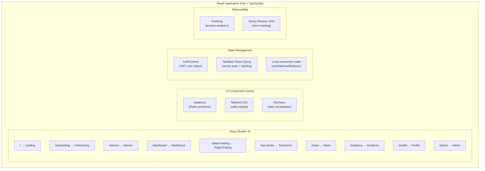
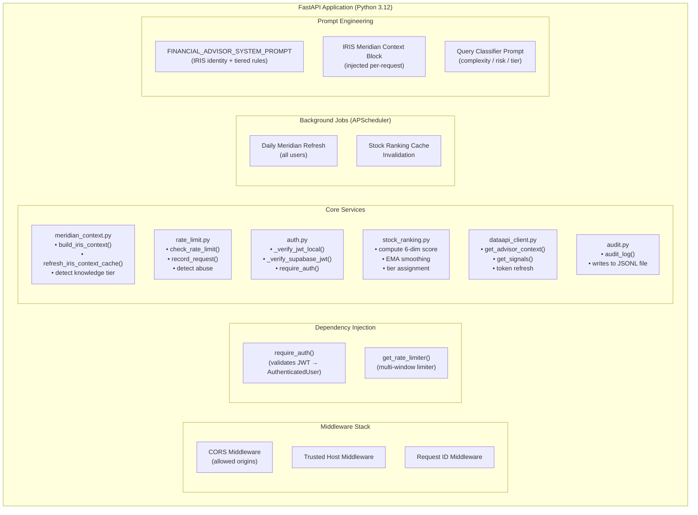

# Diagram 3 — Component / Architecture Diagram

**Diagram Type:** UML Component Diagram
**Purpose:** Shows all software components, their groupings (frontend, backend, database), and their interfaces/dependencies.

---

## High-Level Component Overview

```mermaid
flowchart TB
    subgraph CLIENT ["CLIENT TIER — Browser (Vercel CDN)"]
        direction LR
        subgraph PAGES ["React Pages"]
            P_LAND["Landing"]
            P_ONBOARD["Onboarding"]
            P_ADVISOR["Advisor\n(Chat UI)"]
            P_DASH["Dashboard"]
            P_TRADE["Paper\nTrading"]
            P_STOCKS["Top Stocks"]
            P_NEWS["News Feed"]
            P_ACADEMY["Academy"]
            P_PROFILE["Profile"]
            P_ADMIN["Admin\nPanel"]
        end

        subgraph FRONTEND_SVC ["Frontend Services (src/services/)"]
            FS_AUTH["auth\n(Supabase Auth)"]
            FS_CHAT["chat-api\n(CRUD chat sessions)"]
            FS_TRADE["trading-api\n(positions/trades)"]
            FS_STOCK["stock-ranking-api\n(rankings/scores)"]
            FS_SNAP["stock-snapshots-api\n(market data)"]
            FS_NEWS["news-api\n(articles)"]
            FS_ACADEMY["academy-api\n(lessons/quizzes)"]
            FS_USER["user-data-api\n(profiles/goals)"]
            FS_ENGINE["trade-engine-api\n(signals/context)"]
            FS_WS["tradeEngineWebSocket\n(live prices)"]
        end

        subgraph FRONTEND_CTX ["React Contexts"]
            CTX_AUTH["AuthContext\n(JWT + User)"]
            CTX_CHAT["Chat State"]
            CTX_TRADE["Trading State"]
        end
    end

    subgraph API ["API TIER — FastAPI (Railway/Render)"]
        direction TB
        subgraph ROUTES ["API Routes"]
            R_CHAT["POST /api/chat\nGET /api/chat/history\nPOST /api/chat/title"]
            R_SEARCH["POST /api/search"]
            R_STOCKS["GET /api/stocks/ranking"]
            R_ENGINE["GET /api/v1/ai/context\nGET /api/v1/ai/signals\nGET /api/stock-price/{ticker}"]
            R_ADMIN["GET /api/admin/*"]
            R_MERIDIAN["POST /api/meridian/onboard"]
            R_NEWS["GET /api/news"]
        end

        subgraph BACKEND_SVC ["Backend Services"]
            BS_AUTH["auth.py\n(JWT Validation)"]
            BS_RATE["rate_limit.py\n(Multi-tier limits)"]
            BS_MERIDIAN["meridian_context.py\n(IRIS context builder)"]
            BS_RANK["stock_ranking.py\n(6-dim scoring)"]
            BS_DATAAPI["dataapi_client.py\n(Market data client)"]
            BS_AUDIT["audit.py\n(Security logging)"]
            BS_SCHED["APScheduler\n(Background jobs)"]
        end
    end

    subgraph DB ["DATA TIER — Supabase (PostgreSQL)"]
        direction LR
        SCH_CORE["Schema: core\nusers\nuser_profiles\nachievements\nrate_limit_state"]
        SCH_AI["Schema: ai\nchats\nchat_messages\niris_context_cache"]
        SCH_TRADING["Schema: trading\nopen_positions\ntrades\ntrade_journal\nportfolio_history"]
        SCH_MARKET["Schema: market\nstock_snapshots\nnews\nmarket_indices\ntrending_stocks"]
        SCH_ACADEMY["Schema: academy\ntiers → lessons → sections\nquizzes → questions\nuser_progress"]
        SCH_MERIDIAN["Schema: meridian\nuser_goals\ngoal_progress\nrisk_alerts\nfinancial_plans\nlife_events"]
    end

    subgraph EXTERNAL ["EXTERNAL SERVICES"]
        EXT_OPENAI["OpenAI API\nGPT-5 / GPT-4o-mini"]
        EXT_PERP["Perplexity AI\n(Fallback LLM)"]
        EXT_TAVILY["Tavily Search API"]
        EXT_DATAAPI["TheEyeBeta DataAPI\n(Market Data)"]
        EXT_POSTHOG["PostHog Analytics"]
        EXT_SENTRY["Sentry Monitoring"]
    end

    %% ── Client → API ─────────────────────────────────────────────
    FRONTEND_SVC -->|"HTTPS REST\n(auth header: Bearer JWT)"| ROUTES
    FS_WS -->|"WSS WebSocket\n(live price stream)"| R_ENGINE

    %% ── Client → Supabase (direct) ───────────────────────────────
    FS_AUTH -->|"Supabase Auth SDK\n(login/session)"| SCH_CORE
    FS_CHAT -->|"Supabase REST\n(read messages)"| SCH_AI
    FS_TRADE -->|"Supabase REST\n(positions/history)"| SCH_TRADING
    FS_SNAP -->|"Supabase REST\n(market snapshots)"| SCH_MARKET
    FS_NEWS -->|"Supabase REST\n(articles)"| SCH_MARKET
    FS_ACADEMY -->|"Supabase REST\n(lessons/progress)"| SCH_ACADEMY
    FS_USER -->|"Supabase REST\n(profiles/goals)"| SCH_MERIDIAN

    %% ── API → DB ─────────────────────────────────────────────────
    ROUTES --> BS_AUTH
    ROUTES --> BS_RATE
    BS_RATE -->|"Persist limits"| SCH_CORE
    BS_MERIDIAN -->|"Read/write context cache"| SCH_AI
    BS_MERIDIAN -->|"Read goals/alerts/profile"| SCH_MERIDIAN
    BS_RANK -->|"Read stock snapshots"| SCH_MARKET
    BS_AUDIT -->|"Write audit.jsonl"| ROUTES
    BS_SCHED -->|"Daily refresh"| BS_MERIDIAN

    %% ── API → External ───────────────────────────────────────────
    R_CHAT -->|"Chat completion requests"| EXT_OPENAI
    R_CHAT -->|"Fallback requests"| EXT_PERP
    R_SEARCH -->|"Search queries"| EXT_TAVILY
    BS_DATAAPI -->|"Market data requests"| EXT_DATAAPI
    BS_SCHED -->|"Errors/traces"| EXT_SENTRY

    %% ── Client → External ────────────────────────────────────────
    CTX_AUTH -->|"Usage events"| EXT_POSTHOG
    CTX_AUTH -->|"JS errors"| EXT_SENTRY

    %% ── Styling ──────────────────────────────────────────────────
    style CLIENT fill:#1a2744,stroke:#4a9eff,color:#e0e0e0
    style API fill:#1a3a1a,stroke:#4caf50,color:#e0e0e0
    style DB fill:#1a3a44,stroke:#3ecf8e,color:#e0e0e0
    style EXTERNAL fill:#3a1a2a,stroke:#ff6d9d,color:#e0e0e0
```

---

## Detailed Component Breakdown

### Frontend Components

### Backend Components

---

## Component Interface Summary

| Component | Exposes | Consumes |
|-----------|---------|----------|
| `auth.py` | `require_auth()` → `AuthenticatedUser` | Supabase JWT secret, Supabase REST `/auth/v1/user` |
| `rate_limit.py` | `check_rate_limit()`, `record_request()` | `core.rate_limit_state` table |
| `meridian_context.py` | `build_iris_context()`, context string | `core.user_profiles`, `meridian.*`, `ai.iris_context_cache` |
| `stock_ranking.py` | `/api/stocks/ranking` response | `market.stock_snapshots`, in-memory cache |
| `dataapi_client.py` | `get_advisor_context()`, `get_signals()` | TheEyeBeta DataAPI (external) |
| `audit.py` | `audit_log(event, data)` | Filesystem (JSONL) |
| `chat route` | Streamed AI response | OpenAI API, Perplexity API, Tavily API, meridian_context |
