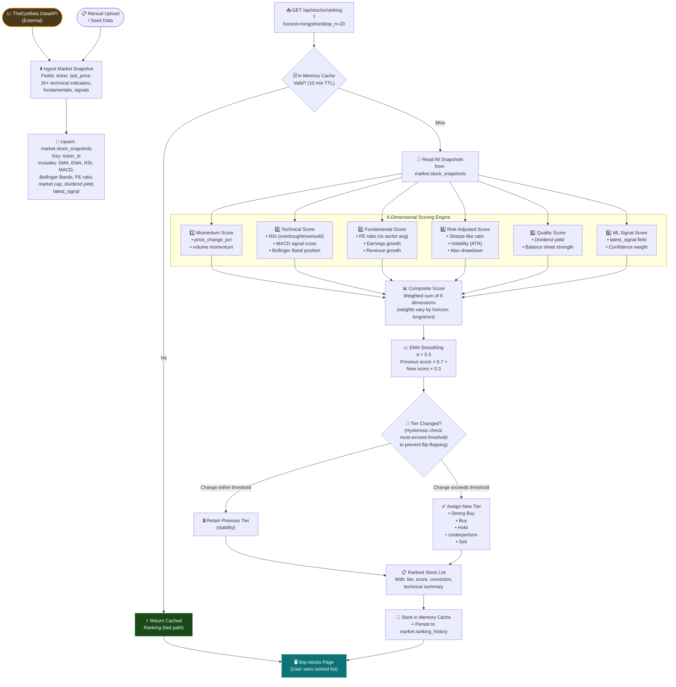
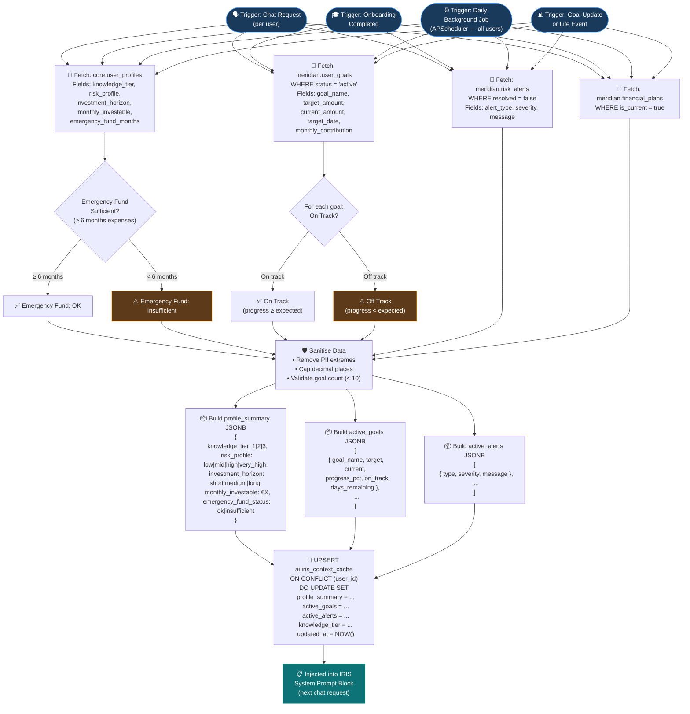
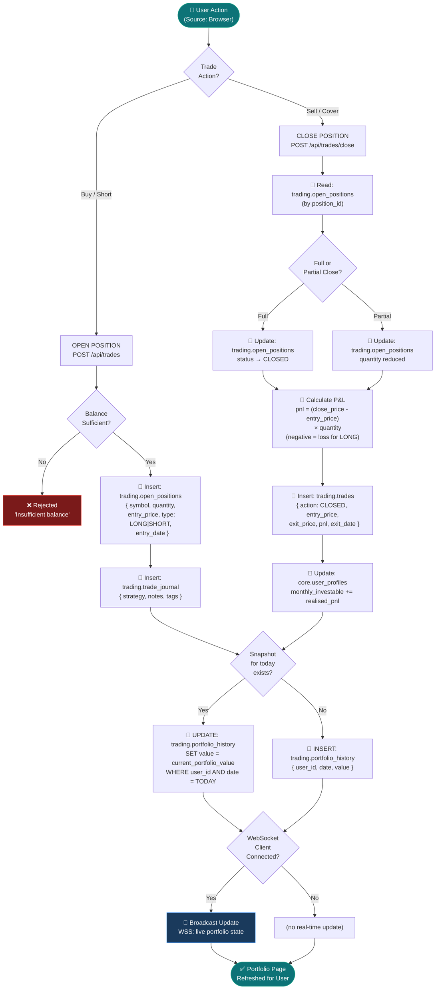

# Diagram 4 — Data Pipeline Diagram

**Diagram Type:** Data Flow Diagram with Decision Conditions
**Purpose:** Shows all major data pipelines in the system — where data originates, how it is transformed, what conditions branch the flow, and where it is stored or consumed.

---

## Pipeline 1 — AI Chat Request Pipeline (Core Flow)

This is the primary pipeline. Every user chat message travels this path.

```mermaid
flowchart TD
    %% ── Source ───────────────────────────────────────────────────
    IN_MSG(["📨 User Message\n(Source: Browser)"])

    %% ── Auth Gate ────────────────────────────────────────────────
    AUTH{"🔐 JWT Valid?\n(require_auth)"}
    AUTH_FAIL["❌ 401 Unauthorised\n→ User redirected to Login"]

    %% ── Rate Limit Gate ──────────────────────────────────────────
    RATE{"📊 Rate Limit\nExceeded?\n(core.rate_limit_state)"}
    RATE_BLOCK["❌ 429 Too Many Requests\n→ Retry-After header returned"]

    %% ── Meridian Context ─────────────────────────────────────────
    CACHE{"📦 IRIS Context\nCache Valid?\n(ai.iris_context_cache)"}
    BUILD_CTX["🔄 Build Context\nRead: core.user_profiles\nRead: meridian.user_goals\nRead: meridian.risk_alerts\nRead: meridian.financial_plans\nCompute: emergency fund status\nCompute: on_track vs off_track"]
    USE_CTX["✅ Use Cached\nIRIS Context"]

    %% ── Query Classification ─────────────────────────────────────
    CLASSIFY["🧠 Classify Query\n(GPT-5-mini)\nOutput: complexity, risk, requires_calc, tier"]

    %% ── Knowledge Tier Detection ─────────────────────────────────
    TIER{"🎓 Knowledge\nTier Changed?"}
    UPDATE_TIER["📝 Update Tier\n(core.user_profiles +\nai.iris_context_cache)"]

    %% ── Search Intent Detection ──────────────────────────────────
    INTENT{"🔍 Requires\nWeb Search?"}
    SEARCH_TYPE{"Search Type?"}
    NEWS_SEARCH["📰 News Search\n→ Tavily: '[ticker] news today'\nSource: Tavily API"]
    GEN_SEARCH["🌐 General Search\n→ Tavily: user query\nSource: Tavily API"]
    SEARCH_RESULTS["Search Results\n(injected into prompt)"]

    %% ── Market Data ──────────────────────────────────────────────
    MARKET_NEED{"📈 Ticker\nMentioned?"}
    DATAAPI["📊 Fetch Market Data\nSource: TheEyeBeta DataAPI\nData: price, signals,\ntechnical indicators"]

    %% ── Prompt Assembly ──────────────────────────────────────────
    PROMPT["📋 Assemble IRIS Prompt\n1. Base system prompt (IRIS identity)\n2. Meridian context block\n3. Search results (if any)\n4. Market data (if any)\n5. Chat history (last 50 msgs)\n6. User message"]

    %% ── LLM Routing ──────────────────────────────────────────────
    CALC{"Requires\nCalculation?"}
    QUANT["🔢 Quantitative Path\nModel: GPT-5\nAnalyse: /api/ai/analyze-quantitative"]
    LLM_PRIMARY{"OpenAI\nAvailable?"}
    OPENAI["🤖 OpenAI GPT-5\n(Primary LLM)"]
    PERPLEXITY["🤖 Perplexity AI\n(Fallback LLM)"]

    %% ── Response Processing ──────────────────────────────────────
    STREAM["📡 Stream Response\n→ Server-Sent Events (SSE)\nto Browser"]

    %% ── Persistence ──────────────────────────────────────────────
    SAVE_MSG["💾 Save to Database\nai.chat_messages\n(role: assistant, content, tokens)"]
    SAVE_CHAT["💾 Update ai.chats\n(updated_at timestamp)"]
    REFRESH_CTX["🔄 Refresh Context Cache\nai.iris_context_cache\n(async, non-blocking)"]
    AUDIT["📝 Audit Log\naudit.jsonl\n(user_id, tokens, model)"]

    %% ── Output ───────────────────────────────────────────────────
    OUT(["✅ Response Displayed\nto User (Browser)"])

    %% ── Flow ─────────────────────────────────────────────────────
    IN_MSG --> AUTH
    AUTH -->|"Invalid"| AUTH_FAIL
    AUTH -->|"Valid"| RATE
    RATE -->|"Exceeded"| RATE_BLOCK
    RATE -->|"OK"| CACHE

    CACHE -->|"Miss / Stale"| BUILD_CTX
    CACHE -->|"Hit"| USE_CTX
    BUILD_CTX --> CLASSIFY
    USE_CTX --> CLASSIFY

    CLASSIFY --> TIER
    TIER -->|"Yes"| UPDATE_TIER
    TIER -->|"No"| INTENT
    UPDATE_TIER --> INTENT

    INTENT -->|"Yes"| SEARCH_TYPE
    INTENT -->|"No"| MARKET_NEED
    SEARCH_TYPE -->|"News pattern"| NEWS_SEARCH
    SEARCH_TYPE -->|"General pattern"| GEN_SEARCH
    NEWS_SEARCH --> SEARCH_RESULTS
    GEN_SEARCH --> SEARCH_RESULTS
    SEARCH_RESULTS --> MARKET_NEED

    MARKET_NEED -->|"Yes — fetch live data"| DATAAPI
    MARKET_NEED -->|"No"| PROMPT
    DATAAPI --> PROMPT

    PROMPT --> CALC
    CALC -->|"Yes"| QUANT
    CALC -->|"No"| LLM_PRIMARY
    QUANT --> LLM_PRIMARY
    LLM_PRIMARY -->|"Available"| OPENAI
    LLM_PRIMARY -->|"Rate limited / down"| PERPLEXITY

    OPENAI --> STREAM
    PERPLEXITY --> STREAM

    STREAM --> SAVE_MSG
    STREAM --> OUT
    SAVE_MSG --> SAVE_CHAT
    SAVE_CHAT --> REFRESH_CTX
    SAVE_CHAT --> AUDIT

    %% ── Styling ──────────────────────────────────────────────────
    style IN_MSG fill:#0d7377,stroke:#14a085,color:#fff
    style OUT fill:#0d7377,stroke:#14a085,color:#fff
    style AUTH_FAIL fill:#7a1a1a,stroke:#f44336,color:#fff
    style RATE_BLOCK fill:#7a1a1a,stroke:#f44336,color:#fff
    style OPENAI fill:#1a4a1a,stroke:#4caf50,color:#fff
    style PERPLEXITY fill:#1a4a1a,stroke:#4caf50,color:#fff
    style DATAAPI fill:#4a3a1a,stroke:#ff9800,color:#fff
```

---

## Pipeline 2 — Market Data & Stock Ranking Pipeline

---

## Pipeline 3 — Meridian Context Refresh Pipeline

---

## Pipeline 4 — Paper Trading Pipeline

---

## Data Source Summary

| Pipeline | Data Sources | Conditions | Destinations |
|----------|-------------|-----------|--------------|
| AI Chat | User input, `ai.iris_context_cache`, `ai.chat_messages`, OpenAI, Perplexity, Tavily, DataAPI | JWT valid? Rate limit ok? Cache valid? Search needed? Ticker mentioned? | `ai.chat_messages`, `ai.chats`, `ai.iris_context_cache`, `audit.jsonl` |
| Stock Ranking | `market.stock_snapshots`, DataAPI | Cache hit? Tier threshold exceeded? | In-memory cache, `market.ranking_history` |
| Meridian Refresh | `core.user_profiles`, `meridian.user_goals`, `meridian.risk_alerts`, `meridian.financial_plans` | Emergency fund ≥ 6mo? Goal on-track? | `ai.iris_context_cache` |
| Paper Trading | User input, `trading.open_positions`, `core.user_profiles` | Balance sufficient? Full/partial close? WebSocket connected? | `trading.open_positions`, `trading.trades`, `trading.trade_journal`, `trading.portfolio_history` |
