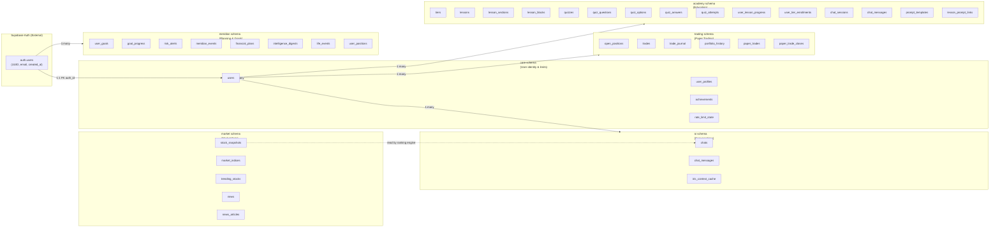
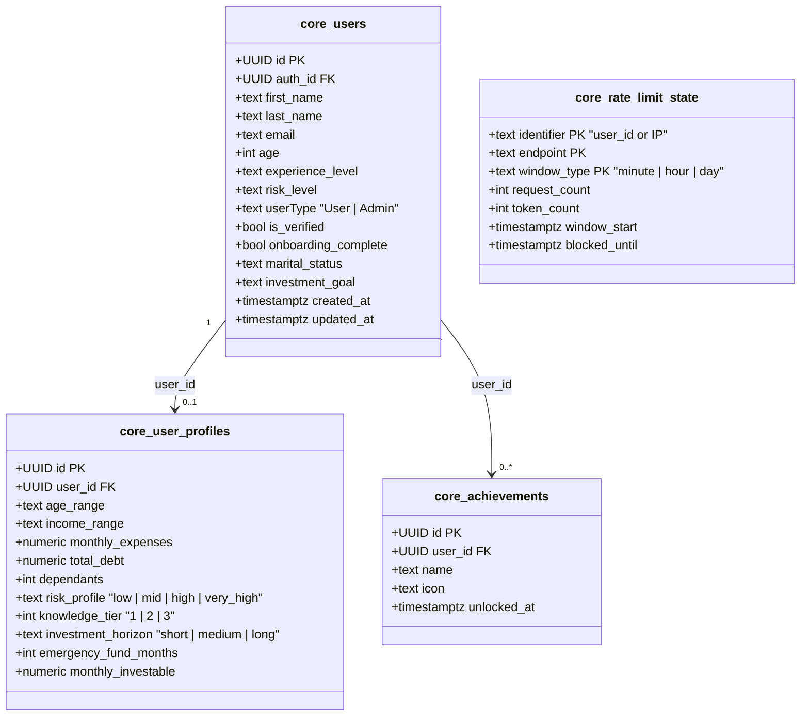
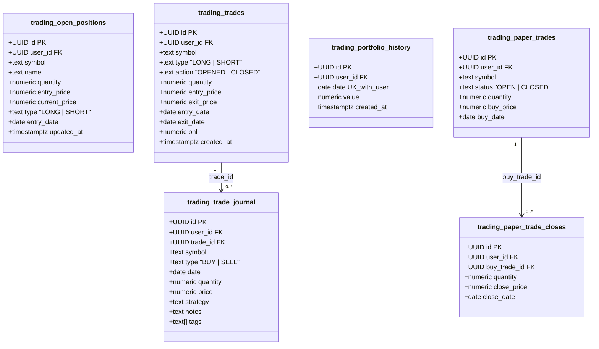
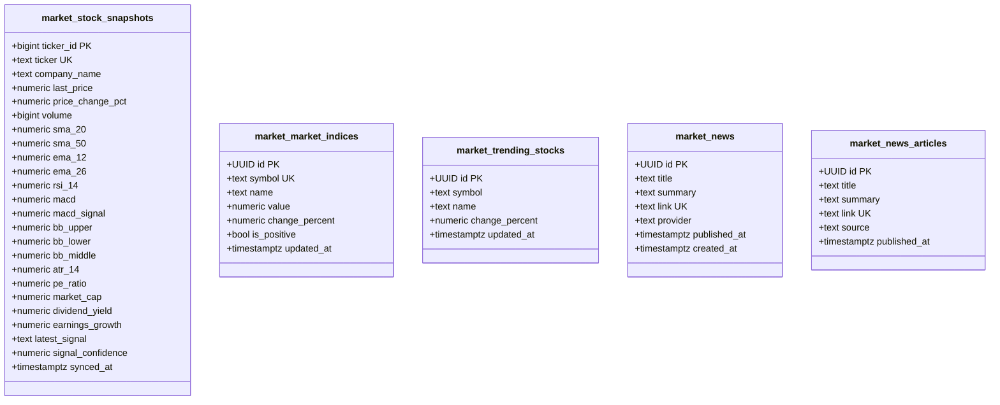
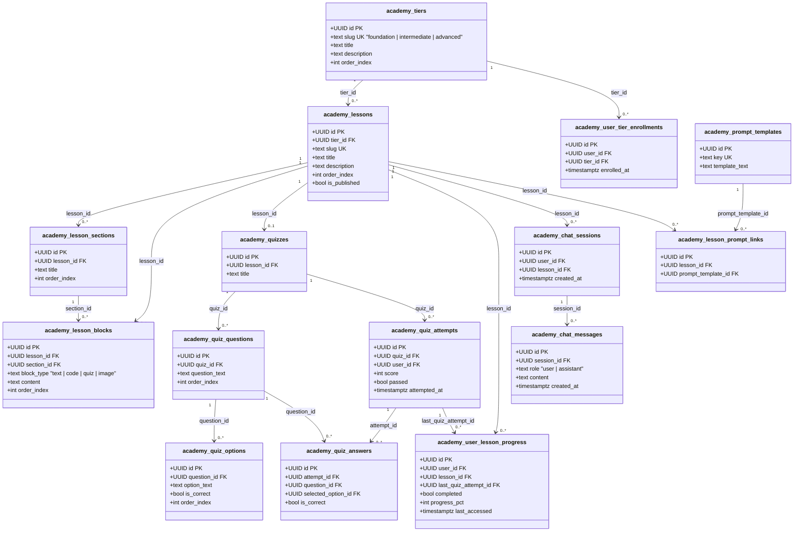
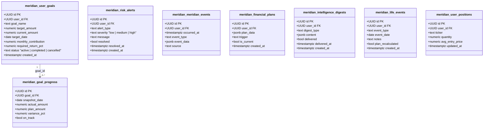

# Diagram 5 — Database Schema (Class / ER Diagram)

**Diagram Type:** Entity-Relationship Diagram + Schema Class View
**Purpose:** Documents all 6 database schemas, their tables, key fields, data types, constraints, and relationships.

> The full Mermaid ER diagram is in [`../database-erd.md`](../database-erd.md).
> This file provides the **annotated schema breakdown** with field-level detail, organised by schema.

---

## Schema Architecture Overview



---

## Schema 1: `core` — User Identity



---

## Schema 2: `ai` — Conversations

```mermaid
classDiagram
    class ai_chats {
        +UUID id PK
        +UUID user_id FK
        +text title
        +timestamptz created_at
        +timestamptz updated_at
    }

    class ai_chat_messages {
        +UUID id PK
        +UUID user_id FK
        +UUID chat_id FK
        +text role "user | assistant"
        +text content
        +timestamptz created_at
    }

    class ai_iris_context_cache {
        +UUID user_id PK
        +jsonb profile_summary "risk, horizon, investable, emergency_fund_status"
        +jsonb active_goals "[ {goal_name, progress_pct, on_track} ]"
        +jsonb active_alerts "[ {type, severity, message} ]"
        +jsonb plan_status
        +int knowledge_tier
        +timestamptz updated_at
    }

    ai_chats "1" --> "0..*" ai_chat_messages : chat_id
```

---

## Schema 3: `trading` — Paper Trading



---

## Schema 4: `market` — Market Data



---

## Schema 5: `academy` — Financial Education



---

## Schema 6: `meridian` — Goals & Financial Planning



---

## Row-Level Security (RLS) Summary

| Schema | Policy | Effect |
|--------|--------|--------|
| `core.users` | `auth.uid() = auth_id` | Users see only their own row |
| `ai.chats` | `auth.uid() = user_id` | Users see only their own chats |
| `ai.chat_messages` | `auth.uid() = user_id` | Users see only their own messages |
| `trading.*` | `auth.uid() = user_id` | Users see only their own trades |
| `meridian.*` | `auth.uid() = user_id` | Users see only their own goals/plans |
| `academy.user_*` | `auth.uid() = user_id` | Users see only their progress |
| `market.*` | `TRUE` (public read) | All authenticated users can read |
| `core.rate_limit_state` | Service role only | No user-level access |

---

## Database Constraint Summary

| Table | Unique Constraint | Purpose |
|-------|-------------------|---------|
| `trading.portfolio_history` | `(user_id, date)` | One snapshot per user per day |
| `core.rate_limit_state` | `(identifier, endpoint, window_type)` | One counter per user/endpoint/window |
| `market.stock_snapshots` | `ticker` | One snapshot per ticker symbol |
| `market.news` | `link` | No duplicate news articles |
| `market.news_articles` | `link` | No duplicate legacy articles |
| `market.market_indices` | `symbol` | One entry per market index |
| `academy.tiers` | `slug` | One tier per knowledge level |
| `academy.lessons` | `slug` | Unique lesson identifiers |
| `academy.prompt_templates` | `key` | Unique prompt template keys |
