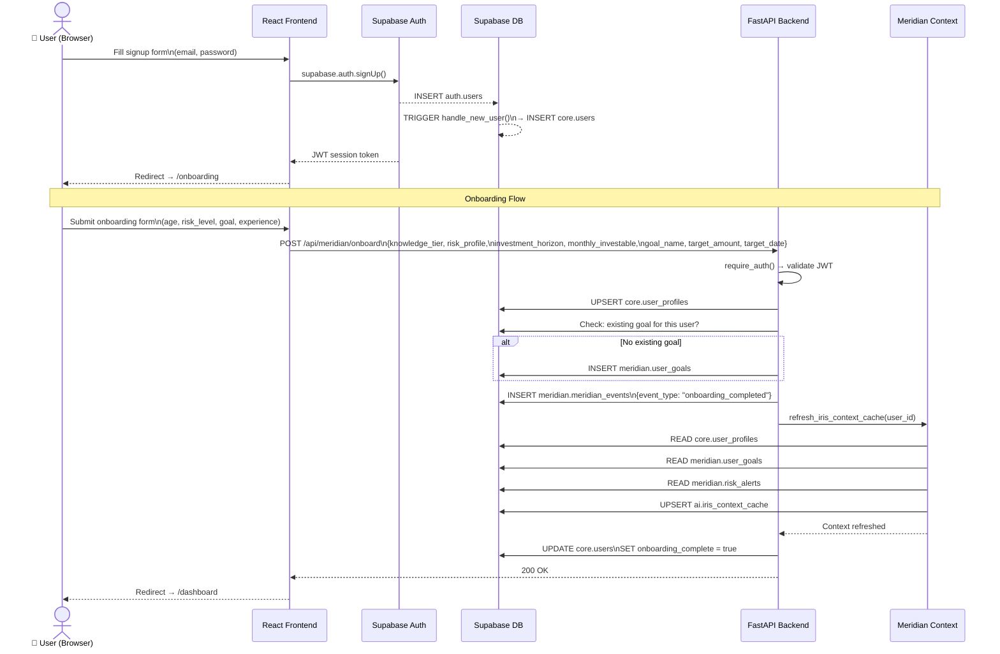
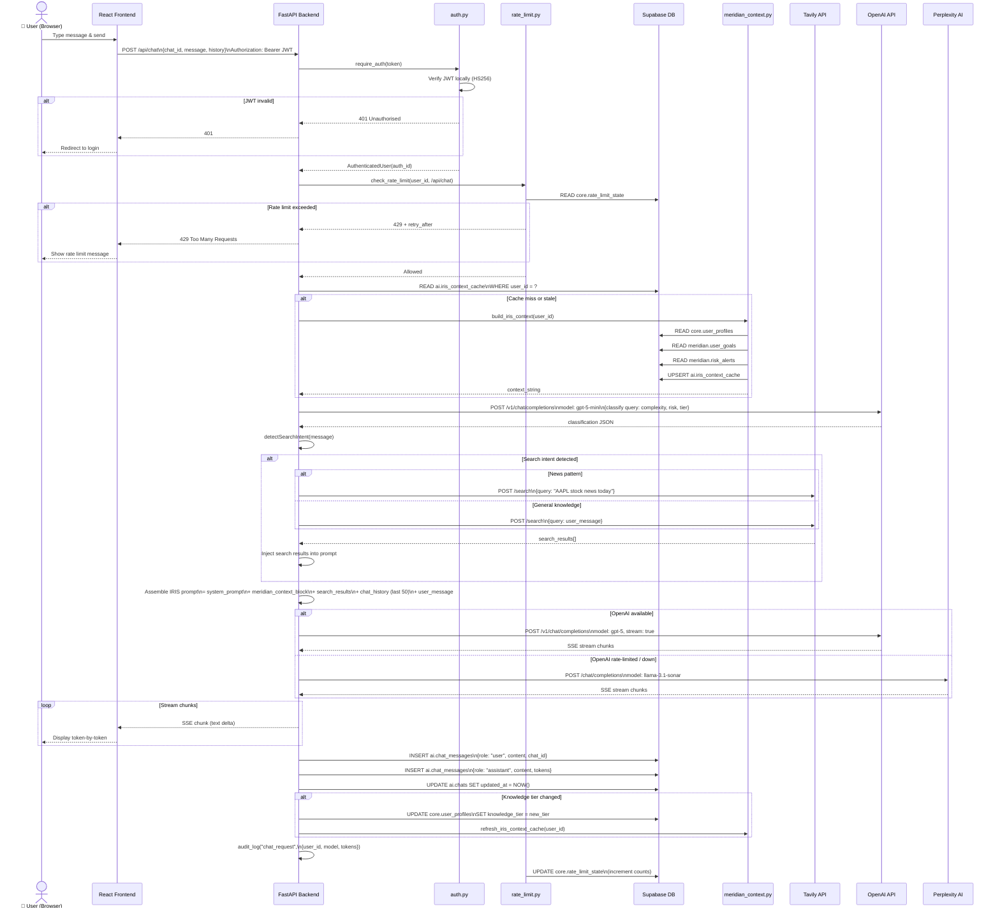
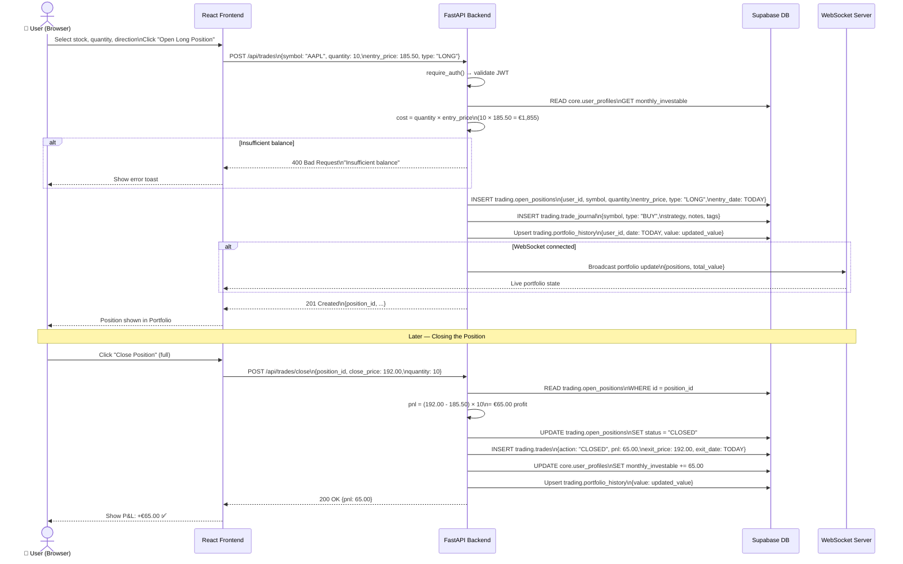
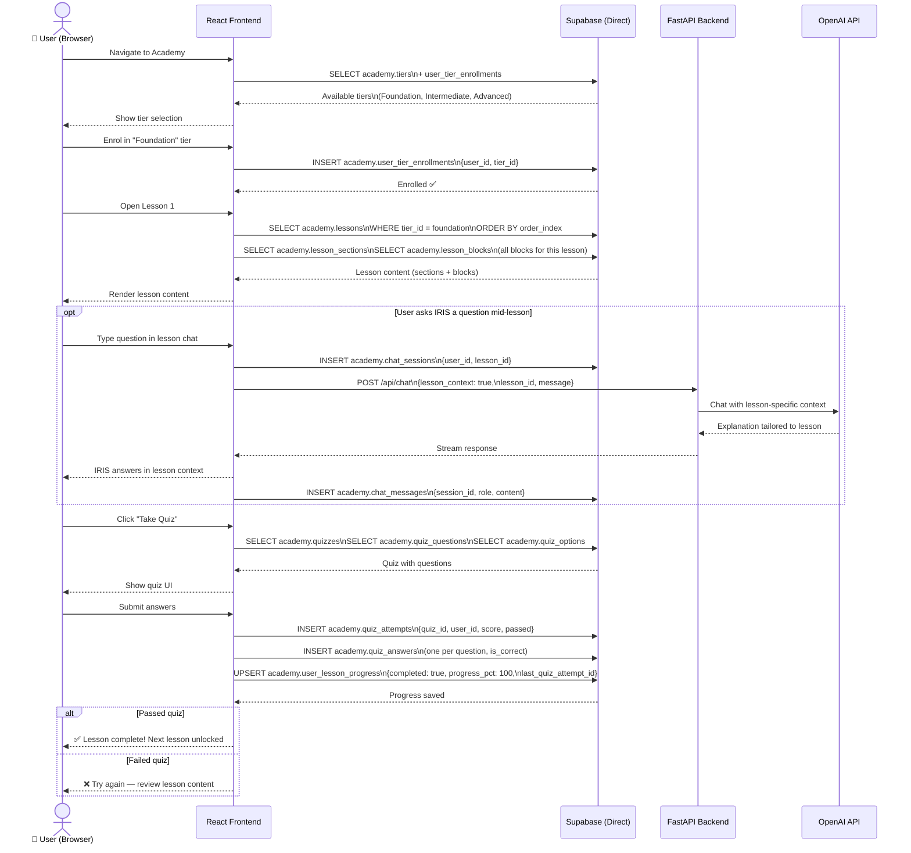
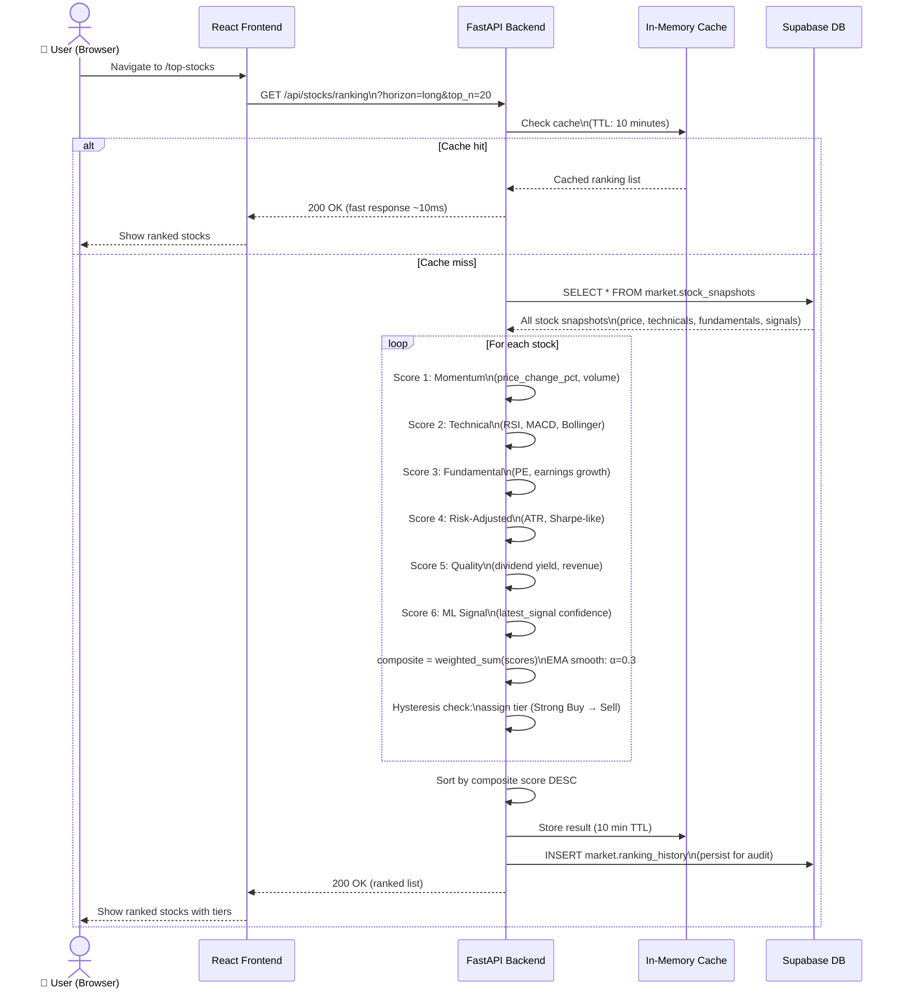
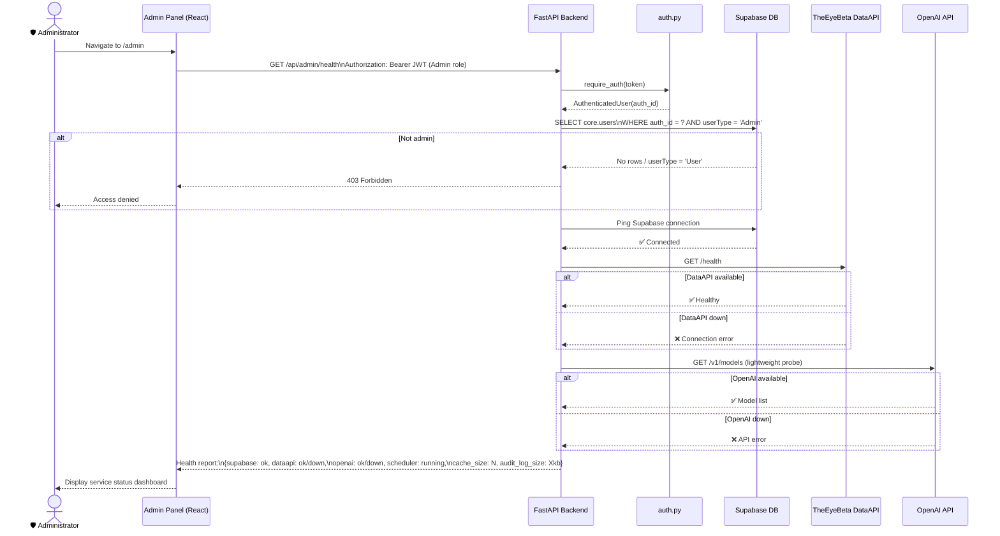

# Diagram 6 — Sequence Diagrams

**Diagram Type:** UML Sequence Diagrams
**Purpose:** Shows the time-ordered interactions between components for each key system workflow.

---

## Sequence 1 — User Registration & Onboarding

---

## Sequence 2 — AI Chat Flow (Full Path)

---

## Sequence 3 — Paper Trade Execution

---

## Sequence 4 — Academy Lesson & Quiz Flow

---

## Sequence 5 — Stock Ranking Request

---

## Sequence 6 — Admin System Health Check

