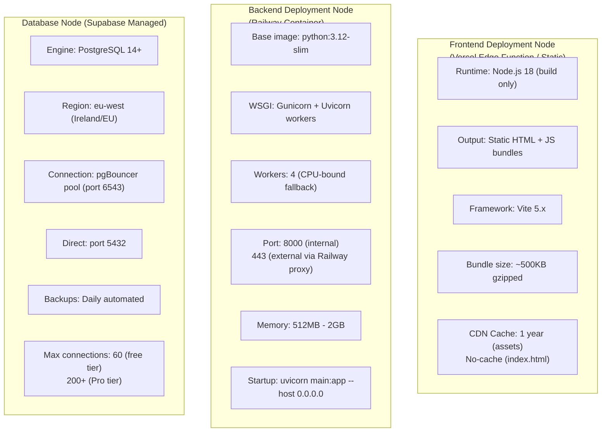
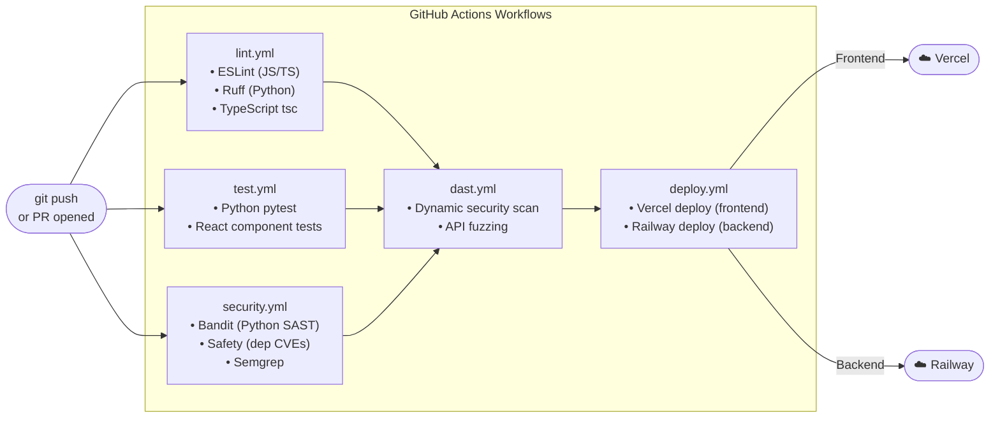

# Diagram 7 — Deployment Diagram

**Diagram Type:** UML Deployment / Infrastructure Diagram
**Purpose:** Shows the physical and logical deployment of the system across hosting platforms, environments, and network boundaries.

---

## Production Deployment Architecture

```mermaid
flowchart TB
    %% ── User Devices ─────────────────────────────────────────────
    subgraph DEVICES ["User Devices"]
        BROWSER["🌐 Web Browser\n(Chrome / Firefox / Safari)\nHTTPS + WebSocket"]
    end

    %% ── CDN / Frontend ───────────────────────────────────────────
    subgraph VERCEL ["☁️ Vercel (Frontend Hosting)"]
        direction TB
        CDN["Global CDN Edge Network\n(200+ PoPs worldwide)"]
        subgraph VITE_BUILD ["Vite Build Output"]
            STATIC["Static Assets\n(HTML, JS bundles, CSS)"]
            SPA["Single Page Application\nReact 18 + TypeScript"]
        end
        ENV_FE["Environment Variables\nVITE_SUPABASE_URL\nVITE_SUPABASE_ANON_KEY\nVITE_API_BASE_URL\nVITE_POSTHOG_KEY"]
    end

    %% ── API Server ───────────────────────────────────────────────
    subgraph RAILWAY ["☁️ Railway / Render (Backend Hosting)"]
        direction TB
        subgraph CONTAINER ["Docker Container"]
            GUNICORN["Gunicorn (Process Manager)\n4 workers"]
            subgraph UVICORN ["Uvicorn Workers (ASGI)"]
                FASTAPI["FastAPI Application\nPython 3.12\n/api/* routes"]
                SCHED["APScheduler\n(Background Jobs)"]
            end
        end
        ENV_BE["Environment Variables\nSUPABASE_URL\nSUPABASE_SERVICE_KEY\nSUPABASE_JWT_SECRET\nOPENAI_API_KEY\nTAVILY_API_KEY\nDATAAPI_URL\nDATAAPI_CLIENT_ID\nSENTRY_DSN"]
        LOGS["Log Files\nlogs/audit.jsonl\n(security audit)"]
    end

    %% ── Supabase ─────────────────────────────────────────────────
    subgraph SUPABASE ["☁️ Supabase Platform (Database + Auth)"]
        direction TB
        subgraph SUPABASE_SVC ["Managed Services"]
            SB_AUTH["Auth Service\n(Supabase GoTrue)\nJWT issuance\nemail/OAuth"]
            SB_POSTGRES["PostgreSQL 14+\n6 Schemas:\ncore, ai, trading,\nmarket, academy, meridian"]
            SB_REALTIME["Realtime Service\n(WebSocket subscriptions)"]
            SB_REST["PostgREST\n(Auto REST API)"]
            SB_STORAGE["Storage\n(file uploads)"]
        end
        RLS["Row-Level Security\n(RLS policies on all user tables)"]
        TRIGGERS["DB Triggers\nhandle_new_user()\n→ creates core.users on signup"]
    end

    %% ── External APIs ────────────────────────────────────────────
    subgraph EXTERNAL ["External API Services"]
        OPENAI_API["🤖 OpenAI API\napi.openai.com\nGPT-5, GPT-4o-mini, GPT-5-mini"]
        PERP_API["🤖 Perplexity AI\napi.perplexity.ai\nllama-3.1-sonar-small"]
        TAVILY_API["🔍 Tavily Search API\napi.tavily.com"]
        DATAAPI_EXT["📈 TheEyeBeta DataAPI\n(Market Data Service)"]
    end

    %% ── Monitoring ───────────────────────────────────────────────
    subgraph MONITORING ["Monitoring & Analytics"]
        POSTHOG["📊 PostHog\nus.i.posthog.com\n(Product Analytics)"]
        SENTRY["🐛 Sentry\nsentry.io\n(Error & Performance)"]
    end

    %% ── CI/CD ────────────────────────────────────────────────────
    subgraph CICD ["GitHub Actions CI/CD"]
        LINT["Lint & Type Check\n(ESLint, TypeScript, Ruff)"]
        TESTS["Unit & Integration Tests"]
        SEC_SCAN["Security Scan\n(Bandit, Safety)"]
        DAST["DAST Scan\n(Dynamic Security Testing)"]
        DEPLOY_FE["Deploy → Vercel"]
        DEPLOY_BE["Deploy → Railway/Render"]
    end

    %% ── Network Flows ────────────────────────────────────────────
    BROWSER -->|"HTTPS :443\n(TLS 1.3)"| CDN
    CDN --> STATIC
    STATIC --> SPA

    BROWSER -->|"HTTPS REST\nAuthorization: Bearer JWT"| RAILWAY
    BROWSER -->|"WSS WebSocket\n(live prices)"| RAILWAY
    BROWSER -->|"HTTPS Supabase SDK\n(direct DB queries)"| SUPABASE
    BROWSER -->|"Analytics events"| POSTHOG
    BROWSER -->|"JS error reports"| SENTRY

    RAILWAY -->|"JWT validation\nDB reads/writes"| SUPABASE
    RAILWAY -->|"Chat completions"| OPENAI_API
    RAILWAY -->|"Fallback LLM"| PERP_API
    RAILWAY -->|"Web search"| TAVILY_API
    RAILWAY -->|"Market data"| DATAAPI_EXT
    RAILWAY -->|"Error traces"| SENTRY

    CICD -->|"on push/PR to main"| DEPLOY_FE
    CICD -->|"on push/PR to main"| DEPLOY_BE

    %% ── Styling ──────────────────────────────────────────────────
    style DEVICES fill:#1a1a2e,stroke:#4a9eff,color:#e0e0e0
    style VERCEL fill:#0a0a1a,stroke:#ffffff,color:#e0e0e0
    style RAILWAY fill:#1a2a1a,stroke:#4caf50,color:#e0e0e0
    style SUPABASE fill:#0a2a1a,stroke:#3ecf8e,color:#e0e0e0
    style EXTERNAL fill:#2a1a0a,stroke:#ff9800,color:#e0e0e0
    style MONITORING fill:#2a0a1a,stroke:#ff6d9d,color:#e0e0e0
    style CICD fill:#1a1a2a,stroke:#9b59b6,color:#e0e0e0
```

---

## Detailed Node Specification

---

## Environment Configuration

| Environment | Frontend URL | Backend URL | DB | AI Models |
|-------------|-------------|-------------|-----|-----------|
| **Production** | `https://app.iris-advisor.com` | `https://api.iris-advisor.com` | Supabase Pro | GPT-5, GPT-4o-mini |
| **Staging** | Vercel Preview URL | Railway staging | Supabase staging | GPT-4o-mini |
| **Development** | `http://localhost:5173` | `http://localhost:8000` | Supabase local / cloud | GPT-4o-mini |

---

## CI/CD Pipeline

---

## Network Security Boundaries

| Boundary | Protocol | Auth | Notes |
|----------|----------|------|-------|
| Browser → Vercel CDN | HTTPS TLS 1.3 | None (static assets) | Assets cached at edge |
| Browser → FastAPI | HTTPS REST / WSS | Bearer JWT | All routes require auth |
| Browser → Supabase | HTTPS (SDK) | Anon key + JWT | RLS enforced server-side |
| FastAPI → Supabase | HTTPS | Service role key | Full schema access, bypasses RLS |
| FastAPI → OpenAI | HTTPS | API key | Backend-only, never exposed to client |
| FastAPI → Tavily | HTTPS | API key | Backend-only |
| FastAPI → DataAPI | HTTPS | Client credentials → JWT | Token cached, refreshed 2 min before expiry |
