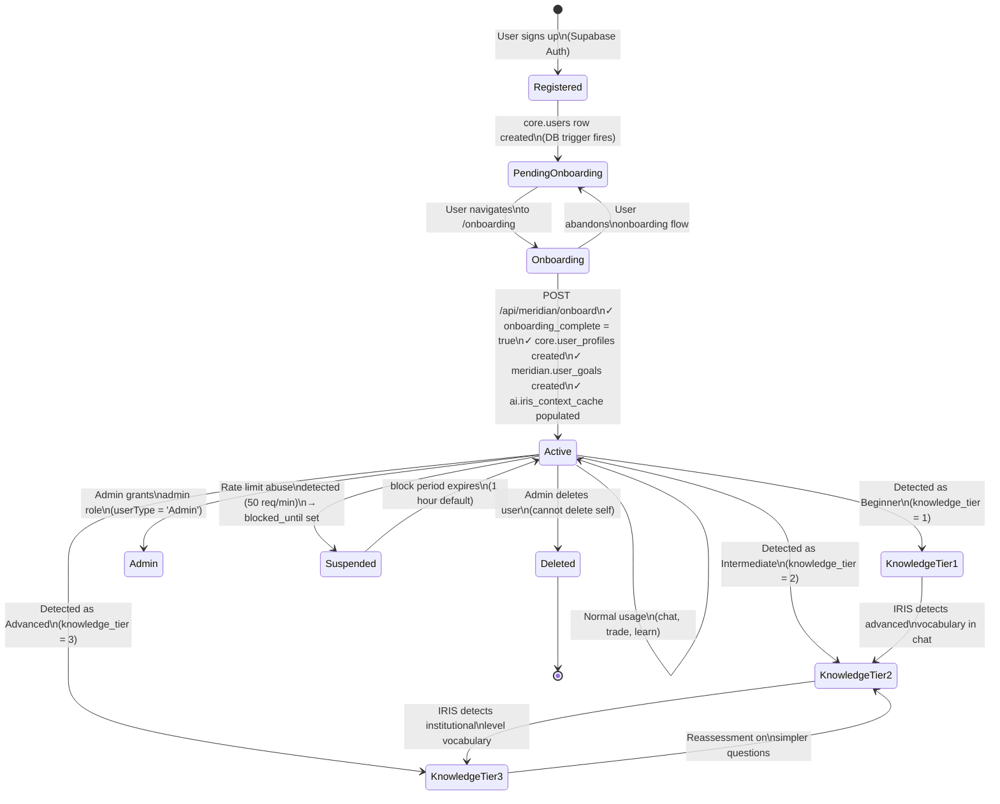
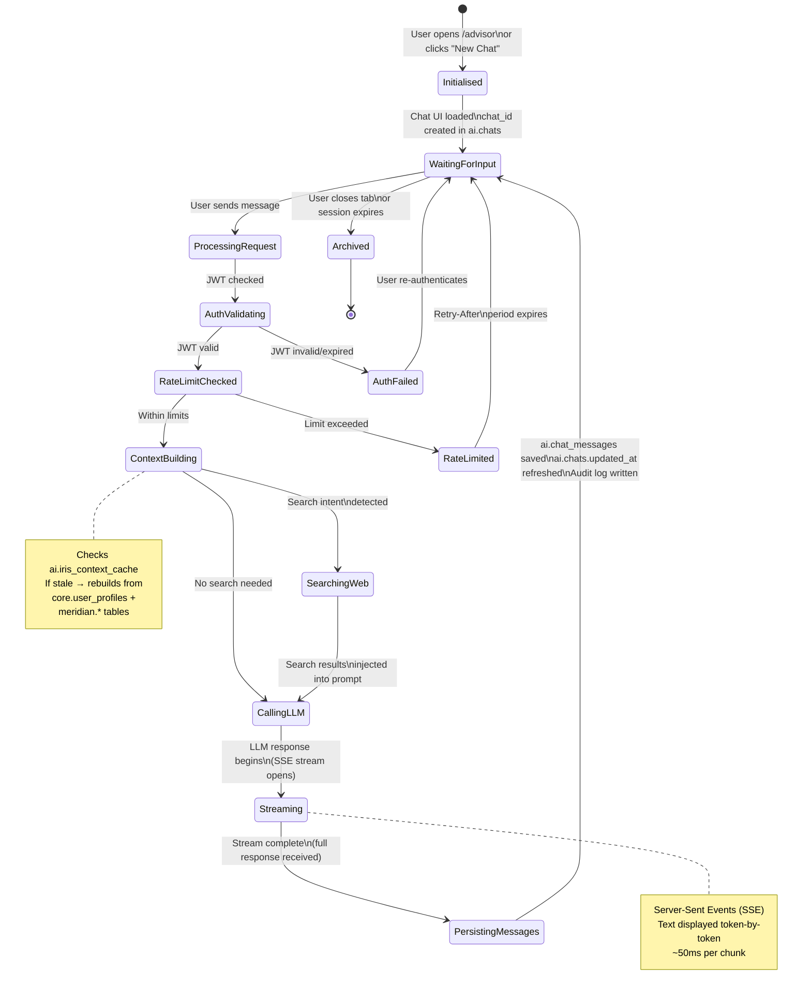
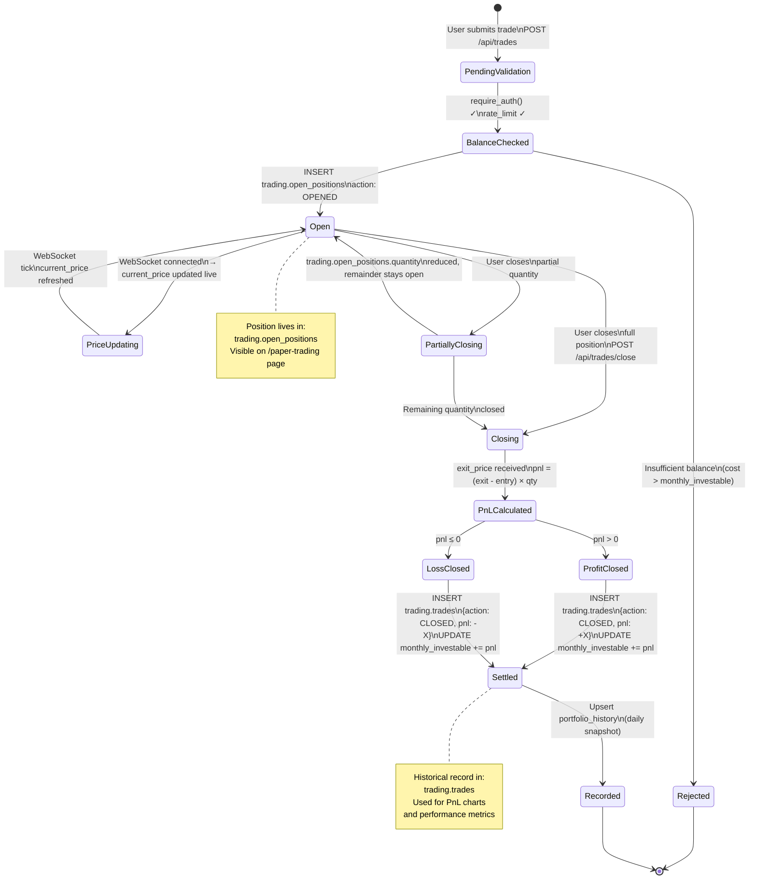
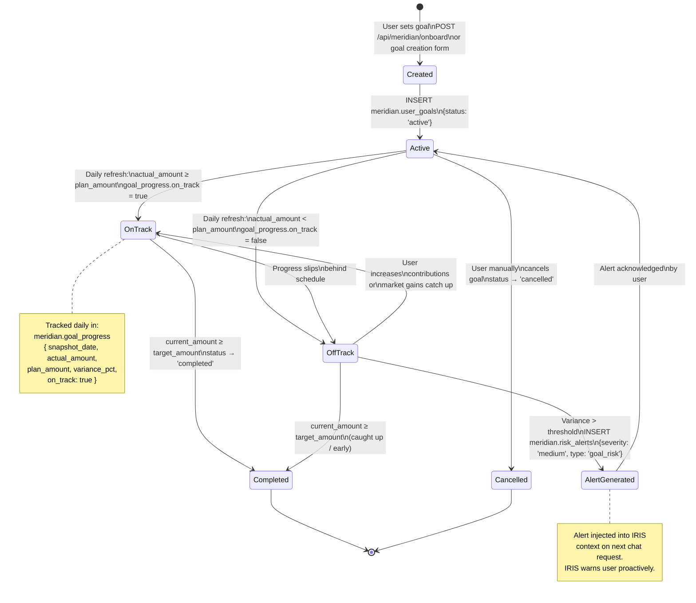
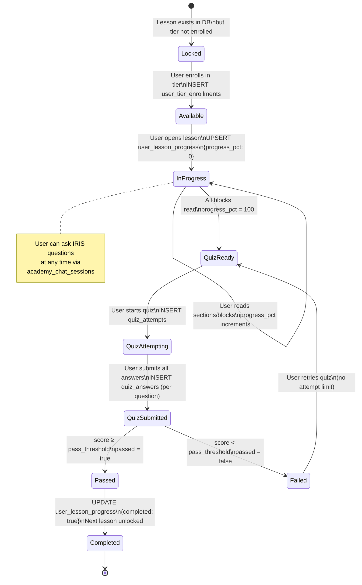
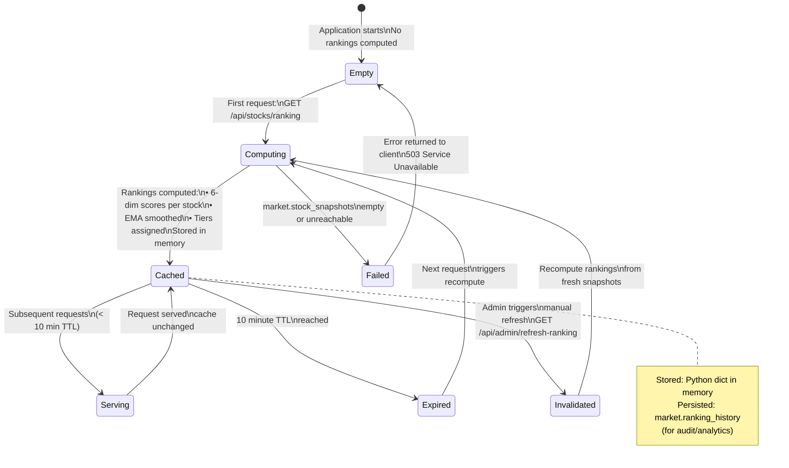

# Diagram 8 — State Machine Diagrams

**Diagram Type:** UML State Machine / Statechart Diagrams
**Purpose:** Shows the valid states and transitions for key entities in the system.

---

## State 1 — User Account Lifecycle

---

## State 2 — Chat Session Lifecycle

---

## State 3 — Trade Position Lifecycle

---

## State 4 — Financial Goal Lifecycle

---

## State 5 — Academy Lesson & Quiz Lifecycle

---

## State 6 — Stock Ranking Cache Lifecycle

