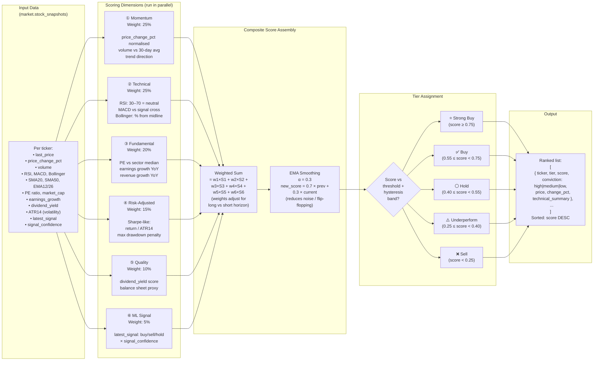

# Diagram 9 — Activity Diagrams

**Diagram Type:** UML Activity Diagrams (Business Process Flows)
**Purpose:** Captures the detailed business logic and parallel activities for key processes.

---

## Activity 1 — Complete User Onboarding Process

```mermaid
flowchart TD
    START([▶ Start: User clicks\n"Get Started"])

    %% ── Auth Check ───────────────────────────────────────────────
    LOGGED_IN{"Already\nlogged in?"}
    SHOW_SIGNUP["Show Sign Up / Login Form"]
    DO_AUTH["Submit credentials\nto Supabase Auth"]
    AUTH_OK{"Auth\nsucceeded?"}
    AUTH_ERR["Show error message\n(invalid credentials)"]

    %% ── Onboarding Steps ─────────────────────────────────────────
    STEP1["Step 1: Personal Details\n• First name, last name\n• Age / age range\n• Marital status"]

    STEP2["Step 2: Financial Profile\n• Monthly income range\n• Monthly expenses\n• Total debt\n• Number of dependants"]

    STEP3["Step 3: Investment Preferences\n• Risk tolerance (Low / Mid / High / Very High)\n• Investment horizon (Short / Medium / Long)\n• Monthly investable amount\n• Emergency fund months"]

    STEP4["Step 4: Financial Goal\n• Goal name (e.g. Buy a house)\n• Target amount (€)\n• Target date\n• Monthly contribution"]

    STEP5["Step 5: Experience Assessment\n• Self-reported experience level\n• Knowledge tier auto-set (1/2/3)"]

    VALIDATE{"All fields\nvalid?"}
    SHOW_ERRORS["Highlight invalid\nfields with errors"]

    %% ── Submission ───────────────────────────────────────────────
    SUBMIT["Submit Onboarding\nPOST /api/meridian/onboard"]

    PAR_START{{parallel}}

    UPD_PROFILE["UPSERT core.user_profiles\n(risk, horizon, investable,\nemergency_fund_months)"]
    INS_GOAL["INSERT meridian.user_goals\n(goal_name, target_amount,\ntarget_date, monthly_contribution)"]
    LOG_EVENT["INSERT meridian.meridian_events\n(onboarding_completed)"]

    PAR_END{{parallel}}

    BUILD_CTX["Build IRIS Context Cache\n• Aggregate user data\n• Compute emergency fund status\n• UPSERT ai.iris_context_cache"]

    SET_COMPLETE["UPDATE core.users\nSET onboarding_complete = true"]

    REDIRECT(["✅ Redirect to /dashboard\nIRIS ready to advise"])

    %% ── Flow ─────────────────────────────────────────────────────
    START --> LOGGED_IN
    LOGGED_IN -->|"No"| SHOW_SIGNUP --> DO_AUTH --> AUTH_OK
    AUTH_OK -->|"No"| AUTH_ERR --> SHOW_SIGNUP
    AUTH_OK -->|"Yes"| STEP1
    LOGGED_IN -->|"Yes"| STEP1

    STEP1 --> STEP2 --> STEP3 --> STEP4 --> STEP5 --> VALIDATE
    VALIDATE -->|"No"| SHOW_ERRORS --> STEP1
    VALIDATE -->|"Yes"| SUBMIT

    SUBMIT --> PAR_START
    PAR_START --> UPD_PROFILE & INS_GOAL & LOG_EVENT
    UPD_PROFILE & INS_GOAL & LOG_EVENT --> PAR_END

    PAR_END --> BUILD_CTX --> SET_COMPLETE --> REDIRECT
```

---

## Activity 2 — IRIS Chat Response Generation (Detailed Process)

```mermaid
flowchart TD
    START(["▶ User sends message"])

    %% ── Security Layer ───────────────────────────────────────────
    subgraph SECURITY ["Security & Rate Limiting"]
        A_AUTH["Validate JWT\n(HS256 local verify\nOR Supabase REST fallback)"]
        A_RATE["Check rate limits\n3 windows: minute / hour / day\n2 dimensions: requests + tokens"]
        A_ABUSE["Check abuse threshold\n(>50 req/min → 1h block)"]
    end

    AUTH_FAIL(["❌ 401 Unauthorised"])
    RATE_FAIL(["❌ 429 Too Many Requests\nRetry-After: X seconds"])

    %% ── Context Assembly ─────────────────────────────────────────
    subgraph CONTEXT ["Context Assembly"]
        A_CACHE{"Cache\nfresh?"}
        A_READ_CACHE["Read ai.iris_context_cache"]
        A_BUILD["Rebuild context:\n1. Read core.user_profiles\n2. Read meridian.user_goals (active)\n3. Read meridian.risk_alerts (open)\n4. Read meridian.financial_plans (current)\n5. Compute: emergency fund ok?\n6. Compute: goals on-track?"]
        A_CACHE_WRITE["UPSERT ai.iris_context_cache"]
    end

    %% ── Classification ───────────────────────────────────────────
    subgraph CLASSIFY ["Query Classification (GPT-5-mini)"]
        A_CLASS["Classify message:\n• complexity: low/medium/high\n• requires_calculation: bool\n• high_risk_decision: bool\n• user_level: detected tier"]
        TIER_CHANGE{"Knowledge tier\nchange detected?"}
        UPD_TIER["UPDATE core.user_profiles\nSET knowledge_tier = new_tier"]
    end

    %% ── Enrichment ───────────────────────────────────────────────
    subgraph ENRICH ["Data Enrichment (Optional)"]
        INTENT{"Search\nintent?"}
        NEWS_PAT{"News\npattern?"}
        NEWS_Q["Tavily search:\n'[ticker] stock news today'"]
        GEN_Q["Tavily search:\nuser query verbatim"]
        TICKER{"Ticker\nmentioned?"}
        DATAAPI_FETCH["TheEyeBeta DataAPI:\n• latest_price\n• technical indicators\n• trading signals\n• recent news for ticker"]
    end

    %% ── Prompt Assembly ──────────────────────────────────────────
    subgraph PROMPT_ASSM ["Prompt Assembly"]
        A_PROMPT["Assemble system prompt:\n━━━━━━━━━━━━━━━━━━━━\n[1] IRIS base identity block\n[2] Tier-specific instructions\n    (Socratic rules for Tier 1/2)\n[3] Meridian context block\n    (goals, alerts, profile)\n[4] Market data (if fetched)\n[5] Search results (if fetched)\n━━━━━━━━━━━━━━━━━━━━\n+ Last 50 messages (history)\n+ Current user message"]
    end

    %% ── LLM Routing ──────────────────────────────────────────────
    subgraph LLM ["LLM Selection & Invocation"]
        CALC{"Requires\ncalculation?"}
        QUANT["Quantitative pre-processing\n(GPT-5 structured output)"]
        PRIMARY{"OpenAI\navailable?"}
        USE_OPENAI["OpenAI GPT-5\nstream: true\nmax_tokens: 8000"]
        USE_PERP["Perplexity AI\n(fallback)\nllama-3.1-sonar"]
    end

    %% ── Response & Persistence ───────────────────────────────────
    subgraph RESPONSE ["Response Streaming & Persistence"]
        STREAM["Stream SSE chunks to client\n(token-by-token display)"]
        PERSIST_USER["INSERT ai.chat_messages\n{role: user, content}"]
        PERSIST_AI["INSERT ai.chat_messages\n{role: assistant, content, tokens_used}"]
        UPD_CHAT["UPDATE ai.chats\nSET updated_at = NOW()"]
        REFRESH_CTX["Async: refresh_iris_context_cache()\n(if tier changed or context stale)"]
        AUDIT["audit_log(chat_request,\n{user_id, model, tokens, timestamp})"]
        RECORD_RATE["UPDATE core.rate_limit_state\n(increment request + token counts)"]
    end

    END(["✅ Response complete\nDisplayed to user"])

    %% ── Flow ─────────────────────────────────────────────────────
    START --> A_AUTH
    A_AUTH -->|"Fail"| AUTH_FAIL
    A_AUTH -->|"Pass"| A_RATE
    A_RATE -->|"Exceeded"| A_ABUSE
    A_ABUSE -->|"Abusive"| RATE_FAIL
    A_ABUSE -->|"Normal exceeded"| RATE_FAIL
    A_RATE -->|"OK"| A_CACHE

    A_CACHE -->|"Hit"| A_READ_CACHE --> A_CLASS
    A_CACHE -->|"Miss"| A_BUILD --> A_CACHE_WRITE --> A_CLASS

    A_CLASS --> TIER_CHANGE
    TIER_CHANGE -->|"Yes"| UPD_TIER --> INTENT
    TIER_CHANGE -->|"No"| INTENT

    INTENT -->|"Yes"| NEWS_PAT
    INTENT -->|"No"| TICKER
    NEWS_PAT -->|"News"| NEWS_Q --> TICKER
    NEWS_PAT -->|"General"| GEN_Q --> TICKER
    TICKER -->|"Yes"| DATAAPI_FETCH --> A_PROMPT
    TICKER -->|"No"| A_PROMPT

    A_PROMPT --> CALC
    CALC -->|"Yes"| QUANT --> PRIMARY
    CALC -->|"No"| PRIMARY
    PRIMARY -->|"Available"| USE_OPENAI --> STREAM
    PRIMARY -->|"Unavailable"| USE_PERP --> STREAM

    STREAM --> PERSIST_USER & PERSIST_AI
    PERSIST_USER & PERSIST_AI --> UPD_CHAT
    UPD_CHAT --> REFRESH_CTX & AUDIT & RECORD_RATE
    REFRESH_CTX & AUDIT & RECORD_RATE --> END
```



---

## Activity 3 — Daily Background Maintenance Process

```mermaid
flowchart TD
    START(["⏰ APScheduler triggers\n(Daily at midnight UTC)"])

    %% ── Meridian Refresh ─────────────────────────────────────────
    subgraph MERIDIAN_REFRESH ["Meridian Context Refresh (All Users)"]
        FETCH_USERS["SELECT user_id FROM\ncore.user_profiles"]
        LOOP_START{{For each user_id}}
        FETCH_DATA["Fetch:\n• core.user_profiles\n• meridian.user_goals (active)\n• meridian.risk_alerts (unresolved)\n• meridian.financial_plans (current)"]
        COMPUTE["Compute:\n• emergency_fund_status\n• goal on_track / off_track\n• plan_status"]
        CHECK_GOALS{"Any goals\noff-track?"}
        GEN_ALERT["INSERT meridian.risk_alerts\n{alert_type: goal_risk,\nseverity: medium}"]
        UPSERT_CTX["UPSERT ai.iris_context_cache\n(profile_summary, active_goals,\nactive_alerts, knowledge_tier)"]
        LOOP_END{{Next user}}
        LOG_REFRESH["Log: N users refreshed\n/ M errors"]
    end

    %% ── Goal Progress Snapshot ───────────────────────────────────
    subgraph GOAL_SNAP ["Goal Progress Snapshot"]
        FETCH_GOALS_ALL["SELECT * FROM meridian.user_goals\nWHERE status = 'active'"]
        GOAL_LOOP{{For each goal}}
        CALC_PROGRESS["Calculate:\n• expected_amount for today\n• variance_pct vs actual\n• on_track = actual ≥ expected"]
        INSERT_PROGRESS["INSERT meridian.goal_progress\n{goal_id, snapshot_date: TODAY,\nactual_amount, plan_amount,\nvariance_pct, on_track}"]
        GOAL_LOOP_END{{Next goal}}
    end

    %% ── Portfolio Snapshot ───────────────────────────────────────
    subgraph PORT_SNAP ["Portfolio Daily Snapshot"]
        FETCH_POSITIONS["SELECT * FROM trading.open_positions\nGROUP BY user_id"]
        PORT_LOOP{{For each user with open positions}}
        CALC_VALUE["Calculate portfolio value:\n= SUM(current_price × quantity)\n+ realized_pnl_YTD\n+ cash_balance"]
        UPSERT_HIST["UPSERT trading.portfolio_history\n{user_id, date: TODAY, value}\nON CONFLICT DO UPDATE"]
        PORT_LOOP_END{{Next user}}
    end

    %% ── Cache Invalidation ───────────────────────────────────────
    subgraph CACHE_INVAL ["Cache Management"]
        INVAL_RANK["Invalidate stock ranking\nin-memory cache\n(force fresh compute on next request)"]
        CLEAN_RATE["Clean expired rate limit windows\nfrom core.rate_limit_state\n(older than 24 hours)"]
    end

    END(["✅ Daily maintenance\ncomplete"])

    %% ── Flow ─────────────────────────────────────────────────────
    START --> FETCH_USERS
    FETCH_USERS --> LOOP_START
    LOOP_START --> FETCH_DATA --> COMPUTE --> CHECK_GOALS
    CHECK_GOALS -->|"Yes"| GEN_ALERT --> UPSERT_CTX
    CHECK_GOALS -->|"No"| UPSERT_CTX
    UPSERT_CTX --> LOOP_END
    LOOP_END -->|"more users"| LOOP_START
    LOOP_END -->|"done"| LOG_REFRESH

    LOG_REFRESH --> FETCH_GOALS_ALL
    FETCH_GOALS_ALL --> GOAL_LOOP
    GOAL_LOOP --> CALC_PROGRESS --> INSERT_PROGRESS --> GOAL_LOOP_END
    GOAL_LOOP_END -->|"more goals"| GOAL_LOOP
    GOAL_LOOP_END -->|"done"| FETCH_POSITIONS

    FETCH_POSITIONS --> PORT_LOOP
    PORT_LOOP --> CALC_VALUE --> UPSERT_HIST --> PORT_LOOP_END
    PORT_LOOP_END -->|"more users"| PORT_LOOP
    PORT_LOOP_END -->|"done"| INVAL_RANK

    INVAL_RANK --> CLEAN_RATE --> END
```



---

## Activity 4 — Stock Ranking Scoring Process


